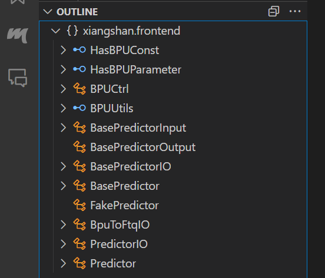
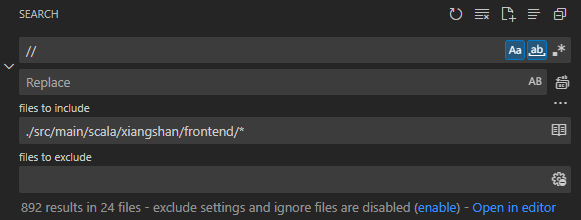

# 面向对象程序设计代码分析报告: XiangShan 南湖架构前端模块阅读 (以 BPU 为中心)

---

## 前言

**工欲善其事, 必先利其器.** 在准备系统阅读 XiangShan 仓库的一部分之前, 笔者先对其使用的硬件构造语言 **Chisel** 做了一定程度的学习. 虽然笔者上手所做第一件事其实还是略览仓库介绍与强行阅读源代码 (为对结构的了解, 并不十分需要对代码实际含义的理解), 但为读者的方便, 在源码阅读报告的第一部分中, 笔者觉得应当先介绍一下 Chisel (其实, 主要是为了方便笔者对 Chisel 学习的自我监督与记录). 在第1.5节, 笔者会尝试解答任务中的三个问题, 若读者对前面的长篇大论无兴趣, 可以直接跳转至那里.

---

## 目录

- [面向对象程序设计代码分析报告: XiangShan 南湖架构前端模块阅读 (以 BPU 为中心)](#面向对象程序设计代码分析报告-xiangshan-南湖架构前端模块阅读-以-bpu-为中心)
  - [前言](#前言)
  - [目录](#目录)
  - [1.1 Chisel 简介](#11-chisel-简介)
  - [1.2 Scala 基础语法](#12-scala-基础语法)
    - [1.2.1 Scala 是什么](#121-scala-是什么)
    - [1.2.2 类型推断](#122-类型推断)
    - [1.2.3 托管嵌入式 DSL](#123-托管嵌入式-dsl)
    - [1.2.4 面向对象编程](#124-面向对象编程)
    - [1.2.5 函数式编程](#125-函数式编程)
  - [1.3 Chisel 库与常用模块](#13-chisel-库与常用模块)
    - [1.3.1 Chisel 库](#131-chisel-库)
    - [1.3.2 Chisel 常用模块](#132-chisel-常用模块)
  - [1.4 Chisel 基础](#14-chisel-基础)
    - [1.4.1 "Hello, Chisel!"](#141-hello-chisel)
    - [1.4.2 Chisel 的基本类型](#142-chisel-的基本类型)
    - [1.4.3 Chisel 的运算符](#143-chisel-的运算符)
    - [1.4.4 Chisel 提供的操作](#144-chisel-提供的操作)
    - [1.4.5 Chisel 的参数](#145-chisel-的参数)
    - [1.4.6 Chisel 的高层次函数与函数式编程](#146-chisel-的高层次函数与函数式编程)
    - [1.4.7 Chisel 的面向对象编程](#147-chisel-的面向对象编程)
  - [1.5 XiangShan 项目](#15-xiangshan-项目)
    - [1.5.1 XiangShan 项目的主要功能和流程](#151-xiangshan-项目的主要功能和流程)
    - [1.5.2 XiangShan 包含的主要功能模块](#152-xiangshan-包含的主要功能模块)
    - [1.5.3 笔者选择分析的功能模块](#153-笔者选择分析的功能模块)
  - [2.1 从 XiangShan 的作者们对 Chisel 的使用说起](#21-从-xiangshan-的作者们对-chisel-的使用说起)
  - [2.2 SiFive 和开源拓展库 Diplomacy](#22-sifive-和开源拓展库-diplomacy)
    - [2.2.1 自熟悉处向上的探索](#221-自熟悉处向上的探索)
    - [2.2.2 UCB, RISC-V, Chisel, SiFive, Rocket Chip](#222-ucb-risc-v-chisel-sifive-rocket-chip)
    - [2.2.3 Diplomacy, LazyModule 与 LazyModuleImp](#223-diplomacy-lazymodule-与-lazymoduleimp)
  - [2.3 BPU 的结构组成](#23-bpu-的结构组成)
    - [2.3.1 uBTB (micro Branch Target Buffer)](#231-ubtb-micro-branch-target-buffer)
    - [2.3.2 FakePredictor](#232-fakepredictor)
    - [2.3.3 FTB (Fetch Target Buffer)](#233-ftb-fetch-target-buffer)

---


## 1.1 Chisel 简介

Chisel 的开发团队来自 UC Berkeley 电子工程与计算机学部.  最初于 2012年, Krste Asanović 教授 (带领着 SLICE Lab, 现在也是 SiFive 的联合创始人以及 RISC-V 基金会的主席) 作为通讯作者于 DAC (Design Automation Conference 2012) 会议上发表了一篇论文 **Chisel: Constructing Hardware in a Scala Embedded Language**, 共有 8 名作者. Chisel 的意思也由此易见: 用 Scala 上的嵌入式语言来构建硬件. 因此, Chisel 也是一门**硬件构造语言 (Hardware Construction Language, HCL)**.

Chisel 是一个开源项目, 在 GitHub 上建立了其仓库 [^chisel].

Chisel 的工作方法, 实际上是将其编写的程序通过一个**中间表示 (Intermidiate Representation, IR)** 翻译为对应的 Verilog 代码. 这个中间表示即 **FIRRTL (Flexible Internal Representation for RTL)** [^firrtl].

## 1.2 Scala 基础语法

虽说本报告是为介绍**香山**源代码中的面向对象思想而生, 但欲读懂香山, 必先读懂其代码; 欲读懂其代码, 必先读懂 Chisel; 欲读懂 Chisel, 必先读懂 Scala. 想必本报告的读者, 了解 Scala 的语法很可能比笔者更强, 但语言毕竟是一个过不去的坎, 还是决定在此介绍一二. 读者大可放心, 这不是 Scala 教程, 因而下文的介绍会围绕**面向对象的编程思想**展开.

### 1.2.1 Scala 是什么

> Scala is yet another programming language which supports common programming paradigms. [^chisel_bootcamp_1]

注: *感谢 chisel-bootcamp 提供的教程, 本部分的几乎所有代码都来自/改自此教程. 因代码太多, 统一在此标注引用: [^Chisel_Bootcamp]*

许多人在面临从未了解过的事物时, 或多或少会有些畏手畏脚, 笔者也不例外; 但是, Scala 的确并没有什么神秘的地方. 事实上, Scala 是一门多范式的编程语言, 支持面向对象和函数式编程范式; 从这个角度来看, Scala 与 C++ 和 Java 还蛮像的.

### 1.2.2 类型推断

但 Scala 的语法更加简洁, 其中一个显目的特点是 Scala 支持**类型推断 (type inference)**. 例如, 在 Scala 中, 我们可以这样定义一个函数:

```scala
def add(x: Int, y: Int): Int = x + y
```

这里, `def` 是 Scala 中定义函数的关键字, `add` 是函数名, `x` 和 `y` 是函数的两个参数, 参数的类型和函数的返回值类型都是 `Int`, 返回 `x + y`. 我们可以省略掉函数的返回值类型, 因为 Scala 会自动推断出函数的返回值类型:

```scala
def add(x: Int, y: Int) = x + y
```

但是, 如果我们省略掉参数的类型, Scala 就无法推断出参数的类型了, 因为 Scala 是一门**强类型 (strong type)** 语言, 所以我们必须显式地声明参数的类型, 否则便会产生报错信息:

```shell
scala> def add(x, y) = x + y
-- [E040] Syntax Error: --------------------------------------------------------
1 |def add(x, y) = x + y
  |         ^
  |         ':' expected, but ',' found
-- [E040] Syntax Error: --------------------------------------------------------
1 |def add(x, y) = x + y
  |            ^
  |            ':' expected, but ')' found
```

若以大家熟知的语言举例, 而 Python 就是一门 **弱类型 (weak type)** 语言, 我们可以这样定义一个函数:

```python
def add(x, y):
    return x + y
```

这个函数的参数类型和返回值类型都是不确定的, 我们可以传入任意类型的参数, 也可以返回任意类型的值. 但是, 这样的灵活性也带来了一些问题. 以贴近面向对象思维的角度看, 函数的参数类型和返回值类型应当是确定的, 这样才能保证函数的可靠性. 就刚刚的函数/方法 `add(x, y)` 而言, 如果我们不知道 `x` 和 `y` 的类型, 那么我们也无法确定函数的返回值类型; 倘用一个类中的方法求值, 以之做类型限制很严格的操作, 必须要程序员心中对此变量的类型十分清楚, 否则便样衰了. 因为强类型的要求, Scala 可以在编译期间就发现错误, 而不是在运行时才发现错误.

笔者正学习另一门课程《智能计算系统》, 在撰写这段报告的同时, 这门课的作业仍在服务器上运行着; 由于 Python 的弱类型特性, 本人的代码曾三次在执行 40min 后遇到类型不匹配的错误; 硬件的要求通常比软件更加严苛, 如此想来, 若是 Chisel 不检查类型, 恐怕出现的 bug 会更加隐蔽.

### 1.2.3 托管嵌入式 DSL

**领域特定语言 (Domain-Specific Language, DSL)** 是专注于某一特定领域的编程语言; 例如, SQL 是一种专注于数据库的 DSL, HTML 是一种专注于网页的 DSL. 与之相对的, **通用编程语言 (General-Purpose Language, GPL)** 是用于编写通用软件的编程语言; 例如, C++ 和 Java 都是 GPL.

硬件设计领域常用的 Verilog 和 VHDL 也是 DSL; 或者说, 既然专注于硬件设计, 那么它们就是硬件设计领域的 DSL. 但是, 与 Verilog 和 VHD 不同, Chisel 是一门**嵌入式 DSL (Embedded DSL)**; 嵌入式 DSL 通常在主语言中作为库实现, 并且往往仅限于主语言的语法. 相比之下, 外部 DSL 是通过独立解释器或编译器实现的, 最经典的例子是 $\LaTeX$, 以及Verilog 和 VHDL 两者. ~~不过不使用独立的解释器或许也可以实现其部分功能, 例如本文刚刚便使用 Markdown 的语法插入了 $\LaTeX$ 符号, 虽然这其实不是 $\LaTeX$ 的功能.~~

嵌入式 DSL 的一个优点是, 它可以利用主语言的所有功能, 从而使之实现更加简单. Chisel 是一个高校开发的开源项目, 开发初期人员较少, 因而选择了更简单的嵌入式 DSL 方式来实现; 这样 Chisel 的开发团队并不需要完成一门完整的语言. ~~颇有模块复用之意味.~~

### 1.2.4 面向对象编程

> Scala 则不同, 它对面向对象的实现是纯粹的: 每个值都是对象, 每个操作都是方法调用. 举例来说, 当你说 `1 + 2` 时, 实际上是在调用 `Int` 类里定义的名称为 `+` 的方法. 你也可以定义名称像操作符的方法, 这样别人就可以用操作符表示法来使用你的 API. [^Scala编程]

Scala 的面向对象极端到了一种程度, 以至于 Scala 从技术上讲并没有操作符重载, 因为它实际上并没有传统意义上的操作符.

这里以五子棋为例做说明. 一个普通的国科大大二学生使用 C 语言写出的五子棋, 可能是这样的:

```C
    while (!game_over)  // 在游戏未结束时执行下棋的循环
    {
        place_error = place_stone(player_turn); // 检查能不能落子
        if (place_error == INPUT_WRONG)           // 落子位置不对或者有字, 需要重新落子
            continue;
        else if (place_error == END_GAME)      // 终止游戏
            break;
        else if (place_error == RESTART_GAME)      // 重启游戏
            goto restart_position;

        copy_inner_board_to_copy(board_copy);   // 拷贝一个棋盘的副本

        if (player_turn == 1)               // 黑棋下才判断禁手
            legal = judge_legal(row_now_global, column_now_global, board_copy);

        print_board(array_for_inner_board_layout);  // 显示棋盘
        copy_inner_board_to_copy(board_copy);   // 拷贝一个棋盘的副本

        if (!legal)     // 触犯禁手
        {
            game_over = 1;
            win = 1;
            printf("黑棋触犯禁手了！白棋获胜. \n");
        }
        else if (judge_winning(player_turn, row_now_global, column_now_global, board_copy)) // 未触犯禁手
        {
            game_over = 1;
            win = player_turn;
            if (player_turn)
                printf("白棋获胜. \n");
            else
                printf("黑棋获胜. \n");
        }
        round++;      // 切换下棋方
        player_turn = round % 2 ? 1 : 2;      // 切换下棋方
    }
```

~~上面的代码并不涉及侵权事宜, 因为这是笔者本人大作业于早期阶段的中间产物.~~ 如果面向对象去完成棋盘的处理, 程序会产生什么变化呢? 或许会变成这样:

```scala
def play {
    while board.place_stone() do {  // 自动切换
        board.print()  // 显示棋盘
        if (!board.judge_legal()) {  // 触犯禁手
            board.lose()
        } else if (board.judge_win) {   // 未触犯禁手
            board.win()
        }
    }
    if (place_error == RESTART_GAME) {   // 重启游戏
        /* 某种处理 */
    }
}
```

我们可以将各种各样的操作都被包装进类中定义的方法里, 并不展现在外. 这段代码看起来简洁多了. 这里的 `board` 是某一个类的实例, 它的方法 `place_stone` 也是一个对象, 各种千奇百怪的操作都被封装进这个方法里了, 而千奇百怪的变量也被封装成了类的对象, 因此代码逻辑简单了很多

### 1.2.5 函数式编程

> In general, a value in a programming language is said to have **first-class** status if it can be passed as a parameter, returned from a subroutine, or assigned into a variable. [^Programming_Language_Pragmatics]

Scala 支持**函数式编程 (functional programming)**, 这是 Scala 与 C++ 和 Java 的另一个不同之处. 函数式编程的一个特点是, 函数是**一等公民 (First-Class Citizen)**, 即函数可以作为参数传递给另一个函数, 也可以作为另一个函数的返回值. 例如, 我们可以这样定义一个函数并用作参数传递给另一个函数:

```scala
def add(x: Int, y: Int) = x + y
def apply(f: (Int, Int) => Int, x: Int, y: Int) = f(x, y)
apply(add, 1, 2)  // return 3
```

而这在 C 中的实现会变得麻烦许多, 因为 C 中的函数不能直接作为参数传递给另一个函数, 而是需要~~找个干爹~~转作函数指针传递:

```c
int add(int x, int y) { return x + y; }
int apply(int (*f)(int, int), int x, int y) { return f(x, y); }
int main() {
    apply(add, 1, 2);  // return 3
    ...
}
```

函数式编程的另一特色是, 函数是纯函数: 相同的输入总会得到相同的输出, 并且不会产生副作用的函数. 无副作用指的是函数内部的操作不会对外部产生影响 (如修改全局变量的值). 会使用 Scala 的程序员定义的函数/方法, 很容易保证其无副作用. 一个无副作用的函数作为参数传递给另一个函数, 也可以保证后者无副作用, 相当于将函数当成表达式来套娃, 以得到代码字面意义上的结果.

## 1.3 Chisel 库与常用模块

### 1.3.1 Chisel 库

同时作为一门硬件构造语言和 Scala 的一个拓展, Chisel是以提供好的一些 `package` 实现硬件生成的. 例如, `chisel3` 包含了 Chisel 的核心类型和函数, `chisel3.util` 包含了一些常用的硬件模块, `chisel3.tester` 包含了 Chisel 的测试工具. 库的使用方法与 Scala 的 `import` 语句一致, 例如:

```scala
import chisel3._
import chisel3.util._
import chisel3.tester._
import chisel3.tester.RawTester.test
import dotvisualizer._
```

### 1.3.2 Chisel 常用模块

`Module` 是所有 Chisel 模块的共同父类, 里面提供了一系列硬件生成方法.

`Bundle` 是一个集线器模块, 专门用来给模块制作输入和输出的接口.

`DecoupledIO` 是一个 Chisel 常用的解耦**接口 (interface)**, 提供有 read-valid 信号的双向数据传输.

`Queue` 创建了一个 FIFO 队列, 两端都有 `DecoupledIO` 接口.

`Arbiter` 和 `RRArbiter` 是仲裁器, 能够将多个 `DecoupledIO` 接入一个 `DecoupledIO` 接口上, 并且指定优先级.

`PopCount` 能返回一个 `UInt` 信号中有几个 1 (有几个 bit 是被置位/拉高的).

`Reverse` 能将输入按位反转.

`UIntToOH` 和 `OHToUInt` 分别能够将 `UInt` 转变为 one-hot 编码格式, 和反过来将 one-hot 码转回数字. 后者是高位优先的.

`PriorityMux` 是有优先级的多路选择器部件, 而 `Mux1H` 则不考虑优先级, 只能在恰好有一个选择信号位高时, 才能选对数据.

`Counter` 是一个按时钟周期自增的计数器. 其实它不是一个模块, 但是笔者在这里也算进去了.

## 1.4 Chisel 基础

### 1.4.1 "Hello, Chisel!"

> The neat thing about hardware construction languages (HCLs) is that we can use the underlying programming language as a scripting language. For example, after declaring our Chisel module, we then use Scala to call the Chisel compiler to translate Chisel Passthrough into Verilog Passthrough. This process is called **elaboration (阐述)**. [^chisel_bootcamp_2_1]

```scala
// Chisel Code, but pass in a parameter to set widths of ports
class PassthroughGenerator(width: Int) extends Module { 
    val io = IO(new Bundle {
        val in = Input(UInt(width.W))
        val out = Output(UInt(width.W))
    })
    io.out := io.in
}

// Let's now generate modules with different widths
println(getVerilog(new PassthroughGenerator(10)))
```

如上的定义构造了一个 `passthrough` 的类 (实为模块). `val` 在 Scala 中表示不会被更改的值, 正好能用于定义固定不变的硬件线路. `io` 使用一个 `IO()` 的形式例化为 `IO` 实例 (其实也是一个对象, 具体细节后文会提及), 其中包含一个新建立的 `Bundle`, 就好似将许多线捆成一捆. 在这里, 我们把各含 `width` 位的输入和输出声明, 并以输入值驱动输出值; 这就相当于连起了 `width` 条硬件线路. 这里甚至用到了宿主语言 Scala 的参数传递, 以实现线宽的手动调整.

模块定义好了, 但是下面的 `println` 又是用来做什么的呢? 显然 `println` 是 Scala 用于输出的函数, 这里我们将一个函数的返回值传给它, 以用做可视化. `getVerilog` 的作用是将 Chisel 转换为 Verilog 代码, 也就是阐述. ~~虽然这个函数其实相当古老, 现在官方有更新的方法生成Verilog代码~~ 通过 `println` 打印出来的 Verilog 代码如下:

```verilog
module PassthroughGenerator(
    input        clock,
    input        reset,
    input  [9:0] io_in,
    output [9:0] io_out
);
    assign io_out = io_in; // some auto-generated comment will appear here
endmodule
```

到这里, 想必熟悉 Verilog 代码的读者已经能完全理解 Chisel 示例代码的作用了. 不过, 硬件没有驱动就没有灵魂, 就像对付软件一般, 硬件也需要有测试例来保证其可行性. 因此, 我们还需要用 Chisel 生成一些测试文件. 例如, 我们可以这样写:

```scala
test(new Passthrough()) { c =>
    c.io.in.poke(0.U)     // Set our input to value 0
    c.io.out.expect(0.U)  // Assert that the output correctly has 0
    c.io.in.poke(1.U)     // Set our input to value 1
    c.io.out.expect(1.U)  // Assert that the output correctly has 1
    c.io.in.poke(2.U)     // Set our input to value 2
    c.io.out.expect(2.U)  // Assert that the output correctly has 2
}
println("SUCCESS!!") // Scala Code: if we get here, our tests passed!
```

这样执行代码, 终端给出的打印结果可能是:

```shell
Elaborating design...
Done elaborating.
test Passthrough Success: 0 tests passed in 2 cycles in 0.052969 seconds 37.76 Hz
SUCCESS!!
```

这段代码的逻辑是, 用 `test` 函数生成一个测试, 用 `poke` 方法先后将输入值设为无符号整数 0, 1, 2, 并用 `expect` 方法检查输出值是否正确, 最后用 `println` 打印出测试结果. 只有每一个测试都通过, 才会打印出 `SUCCESS!!`. 这看似简单的方法实现, 实际上已经十分抽象了, 因为同样的事情在 Verilog 中的实现会变得十分复杂:

```verilog
module test_tb ();
    localparam width = 10;
    reg clock;
    reg reset;
    reg [width - 1 : 0] io_in;
    wire [width - 1 : 0] io_out;

    PassthroughGenerator PassthroughGenerator_inst (
        .clock(clock),
        .reset(reset),
        .io_in(io_in),
        .io_out(io_out)
    );

    always #10 clock = ~clock; // 尽管在这个测试例中没用

    initial begin
        reset <= 1;
        #10 reset <= 0;
        #20 io_in <= 4'd0;
        #20 io_in <= 4'd1;
        #20 io_in <= 4'd2;
        #20 $finish;
    end
endmodule
```

上面的 testbench 仅仅是一个简化版本, 并没有添加比较输出是否正确的逻辑. 可以发现, Verilog 重在描述行为, 而 Chisel 重在描述对某个对象的操作. Chisel 确实能够利用面向对象编程语言帮人们省去不少功夫!

### 1.4.2 Chisel 的基本类型

Chisel 的数据类型都是于 `Chisel.Data` 中定义的, 这是 Chisel 硬件类型的基本类. 有些操作是定义在这之中的, 因此无论什么类型都可以使用这种操作; 而有的操作是定义在这个类的实例 `UInt` 或 `SInt` 等中的, 因此只有某类型内部才能使用这种操作 (比如简单的 `+`). 我们可以用上边界符号 `<:` 判定一个类型是否是另一个类型的子类, 例如:

```scala
class ShiftRegister[T <: Data](gen: T, n: Int) extends Module {
    val io = IO(new ShiftRegisterIO(gen, n))
    
    io.out.foldLeft(io.in) { case (in, out) =>
        out := in
        RegNext(in)
    }
}
```

Chisel 中有几种表示数据的基本类型: `UInt`, `SInt`, `Bool`. `UInt` 和 `SInt` 分别表示无符号整数和有符号整数, `Bool` 表示布尔值. 与之对应的, Verilog 中使用 `wire` 表示连线, 用 `reg` 表示寄存器 (可能是寄存器的东西), 以及 `signed` 和 `unsigned` 的关键字以表明某变量是有符号的还是无符号的, 平时不需要添加, 一般默认值是 `unsigned`. 这会导致偶尔的逻辑错误, 而 Chisel 的新方法确实能解决这个问题. Chisel 中为硬件声明变量时, 一定要用 `val` 而非 `var`. ~~这也是它选择 Scala 作为宿主语言的原因之一 (Scala 鼓励使用 `val` 的表达).~~ 这是因为在硬件中一段线路一旦被产生, 并不会在运行的过程中被更改, 故要用 `val` 保证其确定不变. 如同之前所给出的代码, 我们最初在 Chisel 中自己建立的类, 都会**继承 (extend)** Chisel 提供的 `Module` 类, 表示这是一个硬件模块. 关于这个类, 笔者将会放在后面介绍.

......等等, 读到这里, 作为读者的你若熟悉 Verilog/VHDL, 或许会产生一个疑问: Chisel 用什么表示寄存器呢?

显然, 答案就是 `Reg`. 但是, `Reg` 并非 Verilog 中的 `reg`, 并不是一个数据类型. `Reg` 是~~看似与 `Input/Output` 的~~一个实例, 用法是:

```scala
val reg = Reg(UInt(4.W))
```

以一个很简单的计时器为例, 它每过一个 `clk` 周期, 就会将 `reg` 的值加一, 代码如下:

```scala
class RegisterModule extends Module {
    val io = IO(new Bundle {
        val in  = Input(UInt(12.W))
        val out = Output(UInt(12.W))
    })
    
    val register = Reg(UInt(12.W))
    register := io.in + 1.U
    io.out := register
}
```

Chisel 会自动在 `clk` 信号的上升沿 (从 0 变为 1) 到来时, 把寄存器的值更改掉. 但是实际上, 生成的电路会长这样:

```verilog
module RegisterModule(
    input         clock,
    input         reset,
    input  [11:0] io_in,
    output [11:0] io_out
);
    reg [11:0] register; // @[cmd2.sc 7:21]
    assign io_out = register; // @[cmd2.sc 9:10]
    always @(posedge clock) begin
        register <= io_in + 12'h1; // @[cmd2.sc 8:21]
    end

...

endmodule
```

原本的代码太长不看, 笔者只保留了主要的部分; 其实寄存器对应的是 `always` 块内部的结构, 这里不多做解释. 或者, 还可以更简单一些:

```scala
io.out := RegNext(io.in + 1.U)
```

那如果想为寄存器添加初始值呢? 可以这么改:

```scala
val register = RegInit(UInt(12.W), 0.U)
val register = RegInit(0.U(12.W))
```

这两种方法实际上等价, 而这其实是使用了类构建方法的重载, 两种不同的参数设置, 让我们能够使用两种不同的用法 (但造成的结果一样). 生成硬件的实例使用的类名从 `Reg` 替换为 `RegInit` 之后, 我们可以用一个转换为 `UInt` 类型的 `0` 做初始值, 生成 12 位宽度的寄存器. 所谓 "寄存器" 的返回值类型也可以通过 Scala 的方式声明, 如下的代码返回值就可以使用 Chisel 为 `SInt` 提供的操作方法:

```scala
val reg: SInt = Reg(UInt(4.W))
```

寄存器的刷新和复位需要时钟/复位信号, 这之前读者其实已经见过, 就是 `clock/reset` 信号. 我们也可以自己定义这两个信号到底使用什么:

```scala
import chisel3.experimental.{withClock, withReset, withClockAndReset}

class ClockExamples extends Module {
    val io = IO(new Bundle {
        val in = Input(UInt(10.W))
        val alternateReset    = Input(Bool())
        val alternateClock    = Input(Clock())
        val outImplicit       = Output(UInt())
        val outAlternateReset = Output(UInt())
        val outAlternateClock = Output(UInt())
        val outAlternateBoth  = Output(UInt())
    })

    val imp = RegInit(0.U(10.W))
    imp := io.in
    io.outImplicit := imp

    withReset(io.alternateReset) {
        // everything in this scope with have alternateReset as the reset
        val altRst = RegInit(0.U(10.W))
        altRst := io.in
        io.outAlternateReset := altRst
    }

    withClock(io.alternateClock) {
        val altClk = RegInit(0.U(10.W))
        altClk := io.in
        io.outAlternateClock := altClk
    }

    withClockAndReset(io.alternateClock, io.alternateReset) {
        val alt = RegInit(0.U(10.W))
        alt := io.in
        io.outAlternateBoth := alt
    }
}
```

心细的读者应该会发现, `alternateClock` 这个常量看上去使用了 `Clock` 类型. 这是 Chisel 为时钟信号单独预留的类型.

Chisel 的**多态 (polymorphism)** (继承自 Scala) 十分繁杂, 看起来同样的一种函数, 通过不同类型的参数, 可以实现不同的功能.

### 1.4.3 Chisel 的运算符

Chisel 中的运算符与 Verilog 中的运算符相同, 但是 Chisel (与 Scala 相同) 中的运算符是**方法 (method)**, 而不是**操作符 (operator)**, 它们做的事情其实与最普通的运算不同. 比如上面的代码中, 出现用于硬件连线的 `:=`, 表示将后者上的信号值赋值至前者上 (硬件上的实现其实是简单的连线). 此外, 如同 Verilog 自身, Chisel 支持一些简单的逻辑运算符号, 比如下面的代码:

```scala
class MyOperators extends Module {
    val io = IO(new Bundle {
        val in      = Input(UInt(4.W))
        val out_add = Output(UInt(4.W))
        val out_sub = Output(UInt(4.W))
        val out_mul = Output(UInt(4.W))
    })

    io.out_add := 1.U + 4.U
    io.out_sub := 2.U - 1.U
    io.out_mul := 4.U * 2.U
}
```

这段代码中, 笔者再解释一下出现的诸多方法. `Input(UInt(4.W))` 中的 `.W` 为标明宽度之意, 指输入类型 `UInt` 的线宽为 4 bit. `1.U + 4.U` 中, `.U` 是 Chisel 重载的类型转换方法, 将整型转换成了电路上使用的 `UInt` 类型, 而 `+` 则是被重载的运算符, 用于生成 Verilog 代码中的加号 (或者直接计算出相加后的结果, 本例其实就会直接计算).

### 1.4.4 Chisel 提供的操作

Chisel 还提供了一些简单的模块, 方便我们编写硬件构造代码. 下面简单写两行代码, 举个例子:

```scala
class MyOperatorsTwo extends Module {
    val io = IO(new Bundle {
        val in      = Input(UInt(4.W))
        val out_mux = Output(UInt(4.W))
        val out_cat = Output(UInt(4.W))
    })
    val s = true.B
    io.out_mux := Mux(s, 3.U, 0.U) // should return 3.U, since s is true
    io.out_cat := Cat(2.U, 1.U)    // concatenates 2 (b10) with 1 (b1) to give 5 (101)
}
```

这两个函数模样的东西, 返回值其实是与模块输出相同的 `UInt`, 只是其宽度未知. 再次强调, Chisel 是一门硬件构造语言, 它并不关心线路内部实际的值是什么, 所以 `UInt` 实际上只需要知道位宽信息即可, 因为知道位宽就可以把线路连接起来 (或者, 更简单粗暴地, 生成对应的 Verilog 代码).

Chisel 也提供控制流, 但不是 Scala 的 `if-else`. 如下代码:

```scala
class Max3 extends Module {
    val io = IO(new Bundle {
        ...
    })
        
    when(io.in1 >= io.in2 && io.in1 >= io.in3) {
        io.out := io.in1  
    }.elsewhen(io.in2 >= io.in3) {
        io.out := io.in2 
    }.otherwise {
        io.out := io.in3
    }
}
```

之前的赋值都使用的是 `io` 作为 `Bundle` 的实例名, 显然, 后者是一个类, `io` 是一个对象 (类的实例) 而已. 同样地, 也可以用对象实例化的方法调用已有的模块:

```scala
    ...
    // make the FIR lanes and connect inputs and taps
    val outs = for (i <- 0 until nFilters) yield {
        val fir = Module(new MyManyDynamicElementVecFir(nTaps))
        
        fir.io.in := in.bits.data((i+1)*8, i*8)
        fir.io.valid := in.valid && out.ready
        fir.io.consts := taps(i)            
        fir.io.out
    }
    ...
```

上面的示例中, `val fir = Module(new MyManyDynamicElementVecFir(nTaps))` 就起到了对象实例化的作用; `MyManyDynamicElementVecFir` 是某个用户自行定义的类, 它继承自 `Module` 这个 Chisel 的电路生成基本类; 我们以 `fir` 作为名称, `new` 一个自定义的类作为参数, 来初始化一个 `Module` (`Module` 在这里其实是一个伴随对象, 这里是调用了其内的工厂方法, 这件事会在1.4.7继续讨论), 从而生成类内的硬件, 并调用 `fir.io.in` 等方法, 将这个对象 (实例化的模块) 内部的连线通过 `io` 连接至外部.

Chisel 的测试模块同样也提供了一些抽象程度很高的操作. 例如:

```scala
test(new DecoupledGcd(16)) { dut =>
    dut.input.initSource().setSourceClock(dut.clock)
    dut.output.initSink().setSinkClock(dut.clock)

    val testValues = for { x <- 1 to 10; y <- 1 to 10} yield (x, y)
    val inputSeq = testValues.map { case (x, y) =>
        (new GcdInputBundle(16)).Lit(_.value1 -> x.U, _.value2 -> y.U)
    }
    val resultSeq = testValues.map { case (x, y) =>
        new GcdOutputBundle(16).Lit(_.value1 -> x.U, _.value2 -> y.U, _.gcd -> BigInt(x).gcd(BigInt(y)).U)
    }

    fork {
        dut.input.enqueueSeq(inputSeq)
    }.fork {
        for (expected <- resultSeq) {
            dut.output.expectDequeue(expected)
            dut.clock.step(5) // wait some cycles before receiving the next output to create backpressure
        }
    }.join()
}
```

在 `inputSeq` 和 `resultSeq` 两个常量的初始赋值中, 我们显然可以看到一个 Scala 提供的方法: `map`. `map` 方法接受一个函数参数 (一个醒目的 `=>`, 表示传入的其实是一个**函数字面量 (function literal)**, 是只需要写入参数和函数体的匿名函数), 且对其对象 (`testValues`) 中的所有元素执行这个方法. 那么, `testValues` 是什么呢? 往上看一行, 在 `testValues` 的初始赋值中, 一个 `for` 循环中有一个 `yield` 关键字, 它以不同的 `x` 和 `y` 作为参数, 返回一个个 **元组 (tuple)**, 也就是一个包含两个元素的数组, 这些数组构成了一个**向量 (vector)**, 它再被 `map` 作用产生两个新的常量.

再聚焦 `inputSeq` 生成时使用方法 `map` 内提供的函数自变量: 对参数元组 `(x, y)`, 生成一个新的 `GcdInputBundle` 类, 调用 `.Lit` 方法找出其内的硬件线路(字面量), 并将 `value1` **域 (field)** 与硬件线路值 `x.U` 绑定, `value2` 域与 `y.U` 绑定. 这里的 `U` 与之前的 `.U` 一样, 是 Chisel 重载的类型转换方法, 将整型转换成了电路上使用的 `UInt` 类型. 与此类似, `resultSeq` 的生成也是类似的, 只是绑定的域多了一个 `gcd` (最大公约数).

### 1.4.5 Chisel 的参数

如上所述, Chisel 的每一个 `Module` 都是一个 Scala 类, 以 Scala 的方式进行实例化, 可以在实例化时传入参数, 也要在定义是表明参数类型. 使用 Chisel 时, 传入的参数通常都是硬件线路的位宽 (width), 例如:

```scala
class ParameterizedWidthAdder(in0Width: Int, in1Width: Int, sumWidth: Int) extends Module {
    require(in0Width >= 0)
    require(in1Width >= 0)
    require(sumWidth >= 0)
    val io = IO(new Bundle {
        val in0 = Input(UInt(in0Width.W))
        val in1 = Input(UInt(in1Width.W))
        val sum = Output(UInt(sumWidth.W))
    })
    // a +& b includes the carry, a + b does not
    io.sum := io.in0 +& io.in1
}
```

眼尖的读者一眼就能看到, 这里的 `in0Width`, `in1Width`, `sumWidth` 都是 `Int` 类型, 而 `UInt` 类型的线宽是 `Int` 类型的参数. `require` 函数是 Scala 提供的方法, 用于检查参数是否满足要求, 如果不满足, 则会抛出异常.

另外的用法是用 `Boolean` 类型的值制作不同的硬件, 例如笔者自行编写的全加器/半加器:

```scala
class fullHalfAdder(half: Boolean = false) extends Module {
    val io = IO(new Bundle {
        val a = Input(UInt(1.W))
        val b = Input(UInt(1.W))
        val cin = Input(UInt(1.W))
        val sum = Output(UInt(1.W))
        val cout = Output(UInt(1.W))
    })
    if (half) {
        io.sum := io.a ^ io.b
        io.cout := io.a & io.b
    } else {
        io.sum := io.a ^ io.b ^ io.cin
        io.cout := (io.a & io.b) | (io.a & io.cin) | (io.b & io.cin)
    }
}
```

在模块的实例化时提供一个参数, 其实是增加一层抽象; Verilog 的抽象很麻烦, 其代码的编写者时常被调侃为 "手搓 rtl" (rtl 是 Register Transfer Level 的缩写), 他们不是在 "写代码", 而是在画电路图, 只是有一些简单的包装方法可以使用. Verilog 其实是绘制模块的输入输出端口, 描述寄存器与其间的组合逻辑关系, 并把它们连接到端口上. 而 Chisel 借用 Scala 的这一层抽象的好处是, 很多事情可以异常简化: 绘制线路并不一定要有个宽度, 传参就行 (这件事i启示 Verilog 也可以做到, 但是编写起来略有些麻烦); 选择相近模块的不同功能不需要写两个不一样的类, 用同一个类即可 (Verilog 不好做这件事, 因为 Verilog 的模块作为一个黑盒, 其内部确定性很强, 并没有类那么抽象).

另外, Chisel Bootcamp 提示了我, 类似的事情也可以用 Scala 的 `match` 来实现:

```scala
class DelayBy1(resetValue: Option[UInt] = None) extends Module {
    val io = IO(new Bundle {
        val in  = Input( UInt(16.W))
        val out = Output(UInt(16.W))
    })
    val reg = resetValue match {
        case Some(r) => RegInit(r)
        case None    => Reg(UInt())
    }
    reg := io.in
    io.out := reg
}
```

上面的代码中, `match` 语句的作用是, 如果 `resetValue` 有值, 则用 `RegInit` 方法生成一个带有初始值的寄存器, 否则生成一个不带初始值的寄存器.

这些使用 `Boolean` 的例子全部发生在类的内部. 如果发挥想象力, 自然也能够想到: Chisel 可以用 `Boolean` 作为参数控制 `IO` 的输入输出. Chisel Bootcamp 立刻打了笔者的脸, 给出了一个更完美的半加器/全加器复用示例:

```scala
class HalfFullAdder(val hasCarry: Boolean) extends Module {
    val io = IO(new Bundle {
        val a = Input(UInt(1.W))
        val b = Input(UInt(1.W))
        val carryIn = if (hasCarry) Some(Input(UInt(1.W))) else None
        val s = Output(UInt(1.W))
        val carryOut = Output(UInt(1.W))
    })
    val sum = io.a +& io.b +& io.carryIn.getOrElse(0.U)
    io.s := sum(0)
    io.carryOut := sum(1)
}
```

读者可能会遇到几件困惑的事: 什么是 `Some(Input(UInt(1.W)))`? 什么是 `+&`? 什么是 `.getOrElse(0.U)`? `sum` 后面的 `(0)` 和 `(1)` 又是什么意思? 其实并不复杂.

大多数语言都会提供一个抽象的关键字/对象/宏/只是某种东西, 表示一个对象引用的是 "虚无". 这在 C/C++ 里可以是 `NULL`, 这是一个宏, 它其实是用来表示空指针的; 在 Java 里是 null, 是一个关键字而非对象; Scala 作为一个 "一切皆对象" 的语言, ~~可以提供给读者一个对象~~有一个标准类型 `Option`, 其中有两个特殊的子类: `None` 和 `Some`. `Option` 类型的值通常作为 Scala 集合类型 (`List`, `Map` 等) 操作的返回类型[^scala_option]. Scala 集合类的某些标准操作会返回可选值, 假若这个可选值的确存在, 那么返回的结果会被 `Some` 包装, 否则则会返回 `None`. 上面代码里 Scala 提供的 `.getOrElse` 方法就能够对这种值分类处理:

```scala
def getOrElse[B1 >: B](key: A, default: => B1): B1 = get(key) match {
    case Some(v) => v
    case None => default
}
```

> 除此之外也可以直接使用 `match` 语法进行模式匹配. Scala 鼓励我们使用 `Option` 来表示可选值. 这种处理可选值的方法与 Java 的方式相比有若干优势. 首先, 对代码的读者而言, 某个类型为 `Option[String]` 的变量对应一个可选的 `String`, 与某个类型为 `String` 的变量是一个可选的 `String` (可能为 `null`) 相比, 要直观得多. 不过最重要的是, 我们之前描述的那种不检查某个变量是否为 `null` 就开始使用它的编程错误, 在 Scala 中直接变成了类型错误. 如果某个变量的类型为 `Option[String]`, 而我们把它当作 `String` 来使用, 则这样的 Scala 程序是无法通过编译的. [^Scala编程]

`+&` 则是 Chisel 自行定义的运算符, 其作用为 "为加法提供多出 1 位硬件线宽的输出". 例如, `UInt(1.W) +& UInt(1.W)` 的结果是 `UInt(2.W)`. 这个运算符的定义在 Chisel 的源代码中[^chisel]可以找到:

```scala
    private[chisel3] def binop[T <: Data](sourceInfo: SourceInfo, dest: T, op: PrimOp, other: BigInt): T = {
        requireIsHardware(this, "bits operated on")
        pushOp(DefPrim(sourceInfo, dest, op, this.ref, ILit(other)))
    }
    private[chisel3] def binop[T <: Data](sourceInfo: SourceInfo, dest: T, op: PrimOp, other: Bits): T = {
        requireIsHardware(this, "bits operated on")
        requireIsHardware(other, "bits operated on")
        pushOp(DefPrim(sourceInfo, dest, op, this.ref, other.ref))
    }

    ...

    def do_+&(that: SInt)(implicit sourceInfo: SourceInfo): SInt =
        binop(sourceInfo, SInt((this.width.max(that.width)) + 1), AddOp, that)
```

`SInt((this.width.max(that.width)) + 1)` 向我们暴露了位宽 +1 的关键信息. 而 `sum` 后面的圆括号表示的其实就是其第X位, `sum(0)` 也就是硬件连线的第 0 位.

如果读者并未接触过 Scala 和 Chisel, 这或许一时间有些难懂; 没关系, Chisel 变相提供了更简答的解决办法, 既然我们能够控制硬件线宽, 那么直接使用宽度为 0 的线路不就好了! Chisel 支持宽度为 0 的线路, 也就是说, 我们可以直接使用 `UInt(0.W)` 来表示一个空的线路, 这样的线路不会占用任何资源, 也不会产生任何电路. 于是, 我们可以这样写:

```scala
class HalfFullAdder(val hasCarry: Boolean) extends Module {
    val io = IO(new Bundle {
        val a = Input(UInt(1.W))
        val b = Input(UInt(1.W))
        val carryIn = Input(if (hasCarry) UInt(1.W) else UInt(0.W))
        val s = Output(UInt(1.W))
        val carryOut = Output(UInt(1.W))
    })
    val sum = io.a +& io.b +& io.carryIn
    io.s := sum(0)
    io.carryOut := sum(1)
}
```

读者或许会好奇, 参数能否隐藏地更隐秘一些呢? 答案是肯定的. Scala 提供了 `Implicit` 关键字, 用于声明隐式参数. 隐式参数的作用是, 如果某个函数/方法/类的参数列表中有隐式参数, 那么在调用时, 如果没有传入这个参数, 编译器会自动寻找当前作用域内的一个隐式参数, 并将其传入. 例如, 我们可以这样写:

```scala
sealed trait Verbosity
implicit case object Silent extends Verbosity
case object Verbose extends Verbosity

class ParameterizedWidthAdder(in0Width: Int, in1Width: Int, sumWidth: Int)(implicit verbosity: Verbosity)
extends Module {
    def log(msg: => String): Unit = verbosity match {
        case Silent =>
        case Verbose => println(msg)
    }
    require(in0Width >= 0)
    log(s"in0Width of $in0Width OK")
    require(in1Width >= 0)
    log(s"in1Width of $in1Width OK")
    require(sumWidth >= 0)
    log(s"sumWidth of $sumWidth OK")
    val io = IO(new Bundle {
        val in0 = Input(UInt(in0Width.W))
        val in1 = Input(UInt(in1Width.W))
        val sum = Output(UInt(sumWidth.W))
    })
    log("Made IO")
    io.sum := io.in0 + io.in1
    log("Assigned output")
}

println(getVerilog(new ParameterizedWidthAdder(1, 4, 5)))
println(getVerilog(new ParameterizedWidthAdder(1, 4, 5)(Verbose)))
```

最后两个打印出的 Verilog 代码是相同的, 但是 `println` 的输出却不同, 这是因为隐式参数的存在, 要求第二个 `println` 调用 `log` 函数生成日志文件; 第一个 `println` 接收到的 `log` 函数却不要求其做任何事情. 不过隐式代码很可能会对代码阅读者造成一定的困惑. 另外, Scala 支持一种名为**柯里化 (currying)** 的函数定义方式, 也可以用于简化参数的传递:

```scala
class ParameterizedWidthAdder(in0Width: Int, in1Width: Int, sumWidth: Int)(implicit verbosity: Verbosity)
```

我们单提出这一个参数声明的代码, 它其实是使用了柯里化的结果. `in0Width/in1Width/sumWidth/verbosity` 这四个参数其实都是类的构造函数的参数, 但是 Scala 允许我们将其分成多个部分 (这里是两个部分, 第一个部分是 `in0Width/in1Width/sumWidth`, 第二个部分是 `verbosity`), 这就叫柯里化.

隐式参数与柯里化把括号拆得再多, 究竟也无法提供任意不定数量的变量. Scala 提供了一个特质 `Seq`, 代表序列, 是一种由长度且元素都有固定的从 0 开始的下标位置的 `Iterable` 特质. 用 `Seq[Int]` 做参数, 就可以传入任意数量的整数. 例如:

```scala
class MyManyElementFir(consts: Seq[Int], bitWidth: Int) extends Module {
    val io = IO(new Bundle {
        val in = Input(UInt(bitWidth.W))
        val out = Output(UInt(bitWidth.W))
    })

    val regs = mutable.ArrayBuffer[UInt]()
    for(i <- 0 until consts.length) {
        if(i == 0) regs += io.in
        else       regs += RegNext(regs(i - 1), 0.U)
    }
    
    val muls = mutable.ArrayBuffer[UInt]()
    for(i <- 0 until consts.length) {
        muls += regs(i) * consts(i).U
    }

    val scan = mutable.ArrayBuffer[UInt]()
    for(i <- 0 until consts.length) {
        if(i == 0) scan += muls(i)
        else scan += muls(i) + scan(i - 1)
    }

    io.out := scan.last
}
```

这里, 除了 `Seq[Int]`, 我们还用到了 `ArrayBuffer[UInt]` 作为一个可变集合. `+=` 符号允许我们在其后添加新的元素. 如果读者对 Verilog 不熟悉, 很难想到我在看到这段代码后的震惊: 想要使用 Verilog 实现这种操作, 简直能气疯个人. 首先不能随随便便传一个整形的序列进去, 其次 `for` 循环的写法也有限制, 不能太随便. 我试着用 `println(getVerilog(new MyManyElementFir(Seq(0, 2, 4, 6, 8, 10, 12, 14, 16), 8)))` 生成了一段对应的代码, 在去除一些暂时无用的内容之后, 得到的结果如下:

```verilog
module MyManyElementFir(
    input        clock,
    input        reset,
    input  [7:0] io_in,
    output [7:0] io_out
);
    reg [7:0] regs_1; // @[cmd8.sc 10:33]
    reg [7:0] regs_2; // @[cmd8.sc 10:33]
    reg [7:0] regs_3; // @[cmd8.sc 10:33]
    reg [7:0] regs_4; // @[cmd8.sc 10:33]
    reg [7:0] regs_5; // @[cmd8.sc 10:33]
    reg [7:0] regs_6; // @[cmd8.sc 10:33]
    reg [7:0] regs_7; // @[cmd8.sc 10:33]
    reg [7:0] regs_8; // @[cmd8.sc 10:33]
    wire [8:0] muls_0 = io_in * 1'h0; // @[cmd8.sc 15:23]
    wire [9:0] muls_1 = regs_1 * 2'h2; // @[cmd8.sc 15:23]
    wire [10:0] muls_2 = regs_2 * 3'h4; // @[cmd8.sc 15:23]
    wire [10:0] muls_3 = regs_3 * 3'h6; // @[cmd8.sc 15:23]
    wire [11:0] muls_4 = regs_4 * 4'h8; // @[cmd8.sc 15:23]
    wire [11:0] muls_5 = regs_5 * 4'ha; // @[cmd8.sc 15:23]
    wire [11:0] muls_6 = regs_6 * 4'hc; // @[cmd8.sc 15:23]
    wire [11:0] muls_7 = regs_7 * 4'he; // @[cmd8.sc 15:23]
    wire [12:0] muls_8 = regs_8 * 5'h10; // @[cmd8.sc 15:23]
    wire [9:0] _GEN_0 = {{1'd0}, muls_0}; // @[cmd8.sc 21:28]
    wire [9:0] scan_1 = muls_1 + _GEN_0; // @[cmd8.sc 21:28]
    wire [10:0] _GEN_1 = {{1'd0}, scan_1}; // @[cmd8.sc 21:28]
    wire [10:0] scan_2 = muls_2 + _GEN_1; // @[cmd8.sc 21:28]
    wire [10:0] scan_3 = muls_3 + scan_2; // @[cmd8.sc 21:28]
    wire [11:0] _GEN_2 = {{1'd0}, scan_3}; // @[cmd8.sc 21:28]
    wire [11:0] scan_4 = muls_4 + _GEN_2; // @[cmd8.sc 21:28]
    wire [11:0] scan_5 = muls_5 + scan_4; // @[cmd8.sc 21:28]
    wire [11:0] scan_6 = muls_6 + scan_5; // @[cmd8.sc 21:28]
    wire [11:0] scan_7 = muls_7 + scan_6; // @[cmd8.sc 21:28]
    wire [12:0] _GEN_3 = {{1'd0}, scan_7}; // @[cmd8.sc 21:28]
    wire [12:0] scan_8 = muls_8 + _GEN_3; // @[cmd8.sc 21:28]
    assign io_out = scan_8[7:0]; // @[cmd8.sc 24:10]
    always @(posedge clock) begin
        if (reset) begin // @[cmd8.sc 10:33]
            regs_1 <= 8'h0; // @[cmd8.sc 10:33]
        end else begin
            regs_1 <= io_in; // @[cmd8.sc 10:33]
        end
        if (reset) begin // @[cmd8.sc 10:33]
            regs_2 <= 8'h0; // @[cmd8.sc 10:33]
        end else begin
            regs_2 <= regs_1; // @[cmd8.sc 10:33]
        end

    // 中间的全都一样, 省略

    end
        if (reset) begin // @[cmd8.sc 10:33]
            regs_8 <= 8'h0; // @[cmd8.sc 10:33]
        end else begin
            regs_8 <= regs_7; // @[cmd8.sc 10:33]
        end
    end
endmodule
```

随着输入参数的增加, 可以想象生成的代码量会如何膨胀. 这也是 Chisel 用代码生成代码的好处.

这时, Chisel 突然出现: "嘿, 伙计, 好戏还在后头呢!"

```scala
class MyManyDynamicElementVecFir(length: Int) extends Module {
    val io = IO(new Bundle {
        val in = Input(UInt(8.W))
        val out = Output(UInt(8.W))
        val consts = Input(Vec(length, UInt(8.W)))
    })

    // Reference solution
    val regs = RegInit(VecInit(Seq.fill(length - 1)(0.U(8.W))))
    for(i <- 0 until length - 1) {
        if(i == 0) regs(i) := io.in
        else       regs(i) := regs(i - 1)
    }
  
    val muls = Wire(Vec(length, UInt(8.W)))
    for(i <- 0 until length) {
        if(i == 0) muls(i) := io.in * io.consts(i)
        else       muls(i) := regs(i - 1) * io.consts(i)
    }
    val scan = Wire(Vec(length, UInt(8.W)))
    for(i <- 0 until length) {
        if(i == 0) scan(i) := muls(i)
        else scan(i) := muls(i) + scan(i - 1)
    }

    io.out := scan(length - 1)
}
```

"看啊伙计, 这是一个可变数量的输入!" `val consts = Input(Vec(length, UInt(8.W)))` 使用 `Vec` 类型, 构造了一系列大小相同的输入. 这件事可以在 `Verilog` 里用数组完成, 但是, Chisel能直接为你生成 `length` 个不同的输入向量:

```verilog
module MyManyDynamicElementVecFir(
    input        clock,
    input        reset,
    input  [7:0] io_in,
    output [7:0] io_out,
    input  [7:0] io_consts_0,
    input  [7:0] io_consts_1,
    input  [7:0] io_consts_2,
    input  [7:0] io_consts_3,
    input  [7:0] io_consts_4
);
...
```

上述的所有参数方法, 意味着 Chisel 能更方便得提供一些接口大小和数量可变的模块. 例如通用寄存器堆 (想必无论是做硬件还是软件的读者, 都或多或少了解 CPU 的通用寄存器):

```scala
class RegisterFile(readPorts: Int) extends Module {
    require(readPorts >= 0)
    val io = IO(new Bundle {
        val wen   = Input(Bool())
        val waddr = Input(UInt(5.W))
        val wdata = Input(UInt(32.W))
        val raddr = Input(Vec(readPorts, UInt(5.W)))
        val rdata = Output(Vec(readPorts, UInt(32.W)))
    })
    
    // A Register of a vector of UInts
    val reg = RegInit(VecInit(Seq.fill(32)(0.U(32.W))))
    
    when (io.wen) {
        reg(io.waddr) := io.wdata
    }
    for (i <- 0 until readPorts) {
        when (io.raddr(i) === 0.U) {
            io.rdata(i) := 0.U
        } .otherwise {
            io.rdata(i) := reg(io.raddr(i))
        }
    }
}
```

对应地, Verilog 的写法则是:

```verilog
`define PORT_NUM 2

module reg_file (
    input          clk,
    input  [ 4:0]  waddr,
    input  [ 4:0]  raddr [`PORT_NUM - 1 : 0],
    input          wen,
    input  [31:0]  wdata,
    output [31:0]  rdata [`PORT_NUM - 1 : 0]
);    
    reg [31:0] rf [31:0];
    always @(posedge clk) begin
        if (wen && waddr != 5'b0) begin
            rf[waddr] <= wdata;
        end
    end
    
    genvar i;
    for (i = 0; i < `PORT_NUM; i = i + 1) begin
        assign rdata[i] = {32{|raddr[i]}} & rf[raddr[i]];
    end
endmodule
```

看起来 Verilog 的代码也很简单? 那只是因为这个模块很简单. 事实上, 错综复杂的宏可能使线路产生不可预知的 bug, 经历过某个位置名称写错的痛苦的人, 就知道背后的辛酸了.

什么, 你不承认 Verilog 很麻烦? 那请读者继续往下看...

### 1.4.6 Chisel 的高层次函数与函数式编程

```scala
val muls = Wire(Vec(length, UInt(8.W)))
for(i <- 0 until length) {
    if(i == 0) muls(i) := io.in * io.consts(i)
    else       muls(i) := regs(i - 1) * io.consts(i)
}

val scan = Wire(Vec(length, UInt(8.W)))
for(i <- 0 until length) {
    if(i == 0) scan(i) := muls(i)
    else scan(i) := muls(i) + scan(i - 1)
}

io.out := scan(length - 1)
```

看到上面这段代码了吗? 它之前出现过, 其实是一个对输入历史记录的卷积, 将输入 `io.in` 与 `regs` 中存放的历史输入与 `io.consts` 对应相乘之后再相加. 现在我们直接放个大招:

> assume taps is the list of all samples, with taps(0) = io.in, taps(1) = regs(0), etc. [^chisel_bootcamp_3_3]

```scala
io.out := (taps zip io.consts).map { case (a, b) => a * b }.reduce(_ + _)
```

这一行代码的作用和上面的完全相同. `.zip` 方法将两个使用 `Vec` 定义的 `Wire` 列表按位捆绑起来, 以元组形式返回一个新的列表, 再对此列表中的元素使用 `.map` 方法施加乘法, 并用 `.reduce` 方法将所有元素以 `+` 相连. 用 Scala 提供的**高阶函数 (higher-order function)**, 我们能以抽象的力量, 将原本 Verilog 代码大量重复且晦涩难懂的代码, 用简洁的方式表达出来. 高阶函数, 指的是~~看起来很高级的函数~~ 以函数作为参数或返回值的函数. 在硬件构造语言中, 函数一般是生成硬件逻辑表示用的, 高阶函数则能够用来生成这些"生成逻辑"的语句.

高阶函数向我们展示了 Scala 对函数进行操作/传递的一种可能性, 这是因为 Scala 提供了良好的函数式编程支持. 再次强调, Scala 中的函数是一等公民, 是第一等的对象, 这意味着我们可以将一个函数分配给一个 `val`, 并将其作为参数传递给类, 对象或其他函数. 这样, 使用者自行创建的函数也能够像 Scala 内置的函数一样, 提供给高阶函数使用. 如:

```scala
class Neuron(inputs: Int, act: FixedPoint => FixedPoint) extends Module {
    val io = IO(new Bundle {
        val in      = Input(Vec(inputs, FixedPoint(16.W, 8.BP)))
        val weights = Input(Vec(inputs, FixedPoint(16.W, 8.BP)))
        val out     = Output(FixedPoint(16.W, 8.BP))
    })
    
    val mac = io.in.zip(io.weights).map{ case(a: FixedPoint, b: FixedPoint) => a * b }.reduce(_ + _)
    io.out := act(mac)
}

val Step: FixedPoint => FixedPoint = x => Mux(x <= 0.F(8.BP), 0.F(8.BP), 1.F(8.BP))
val ReLU: FixedPoint => FixedPoint = x => Mux(x <= 0.F(8.BP), 0.F(8.BP), x)
```

给 `Neuron` 类传入 `Step` 或 `ReLU` 作 `act` 对应的输入, 相当于使用了两种有不同激活函数的神经元.

### 1.4.7 Chisel 的面向对象编程

寄宿在 Scala 上的 Chisel 也可以使用其宿主语言的面向对象编程特征, 如**抽象类 (abstract class)** 和**特质 (trait)**. 抽象类与 Java 的抽象类很相似, 差不多相当于一个不能实例化的类, 但是可以提供一些没有具体定义的值; 特质则抽象类有所不同: 它不能包含构造方法; 一个类只能继承自一个父类, 但是可以继承多个特质, 因此特质实际上实现了类似多重继承的功能. Scala 还有对象与**伴随对象 (copanion object)**, 后者之前我们例化模块时便见过, 如:

```scala
class MyModule extends Module {
    val io = IO(new Bundle {
        val in = Input(UInt(8.W))
        val out = Output(UInt(8.W))
    })
    io.out := io.in
}
```

这里, `IO` 其实就是一个伴随对象, 它的 `apply` 方法接收一个 `Bundle` 类型的参数, 并返回一个由同名 `IO` 类实例化的对象. 由于在伴随对象后添加圆括号, 默认会去调用 `.apply` 方法, 所以这里 `MyModule` 类的输入和输出线路也是 `IO` 的 `.apply` 方法产生的. 并且, 每当你想在 Chisel 中创建硬件对象时, 它都需要 `Module` 作为一个超类. 同样的, 伴随对象内还可以定义 `unapply` 方法, 它的任务恰好与 `apply` 相反, 它能根据已经创建好的对象, 把其中的参数提取出来, 这会用在匹配上:

```scala
class Boat(val name: String, val length: Int)
object Boat {
    def unapply(b: Boat): Option[(String, Int)] = Some((b.name, b.length))
    def apply(name: String, length: Int): Boat = new Boat(name, length)
}

def getSmallBoats(seq: Seq[Boat]): Seq[Boat] = seq.filter { b =>
    b match {
        case Boat(_, length) if length < 60 => true
        case Boat(_, _) => false
    }
}
```

## 1.5 XiangShan 项目

从这里开始, 就是所谓的正文了. 下面笔者将逐一回答作业中的三个问题, 并附以一些个人观点.

### 1.5.1 XiangShan 项目的主要功能和流程

> 所以, 团队的唐丹博士和我一直认为要建立一个像Linux那样的开源RISC-V核主线, 既能被工业界广泛应用, 又能支持学术界试验创新想法. 最关键的是, 一定要让它像Linux那样至少存活30年！ [^XiangShan-intro-zhihu]

香山是一个高性能开源 RISC-V 处理器项目.

- 高性能, 意味着设计必须精益求精, 计算速度越快越好.
- 开源, 意味着源代码对任何人的开放性, 所有人都可以拿香山的代码流片, 所有人都可以使用它的代码进行使用或更改.
- RISC-V, 是一个开源开放的指令集, 有短小精悍的优点, 也有拓展与兼容方面的不足. 香山项目的目标是在 RISC-V 这个允许任何人免费实现 CPU 的指令集上, 实现一个能为工业界和学术界广泛使用的开源处理器核.

> 自 2020 年 6 月开始开发的雁栖湖为香山处理器的首个稳定的微架构.   
> 香山的第二代微架构被命名为南湖.   
> 香山的第三代微架构（昆明湖）正在 master 分支上不断开发中. [^XiangShan-intro-zh]

本文中, 笔者将主要阅读香山仓库南湖架构版本的 RTL 代码, 可能会辅以对 master 分支的部分新增功能的阅读.

> 它的架构代号以湖命名. 第一版架构代号是“雁栖湖”, 这是带有浓重国科大情节的同学们起的名字, 因为他们研一都在怀柔雁栖湖待了一年. “雁栖湖”RTL代码于2021年4月完成, 计划于7月基于28nm工艺流片, 目前频率为1.3GHz.   
> 第二版架构代号是“南湖”, 这是向建党100周年致敬. “南湖”计划在今年年底[^今年年底]流片, 将采用14nm工艺, 目标频率是2GHz. [^XiangShan-intro-zhihu]

### 1.5.2 XiangShan 包含的主要功能模块

> 香山本身的 RTL 代码：
>
> - **[XiangShan](https://github.com/OpenXiangShan/XiangShan)**：香山处理器实现
> - **[HuanCun](https://github.com/OpenXiangShan/HuanCun)**：香山处理器的非阻塞 L2/L3 缓存
> - **[FuDian](https://github.com/OpenXiangShan/Fudian)**：香山处理器的浮点部件
>
> 香山的仿真环境：
>
> - **[Difftest](https://github.com/OpenXiangShan/difftest/)**：香山使用的处理器协同仿真框架
> - **[NEMU](https://github.com/OpenXiangShan/NEMU/tree/master)**：一个效率接近 QEMU 的高性能 ISA 解释器, 这里有一个介绍视频
> - **[nexus-am](https://github.com/OpenXiangShan/nexus-am)**：Abstract Machine, 提供程序的运行时环境, 这里有一个简单的介绍
> - **[DRAMsim3](https://github.com/OpenXiangShan/DRAMsim3)**：Cycle-level 地模拟内存的行为, 针对香山项目进行了配置
> - **[env-scripts](https://github.com/OpenXiangShan/env-scripts)**：一些脚本文件, 包括性能分析、模块替换和时序分析等
> - **[xs-env](https://github.com/OpenXiangShan/xs-env)**：香山处理器前端开发环境部署脚本
>
> 香山的文档：
>
> - **[XiangShan-doc](https://github.com/OpenXiangShan/XiangShan-doc)**：香山处理器文档, 包括设计文档、公开报告以及对错误新闻的澄清
>
> 香山项目下的其他仓库还包括 **riscv-linux** , **riscv-pk** , **riscv-torture** 等等. [^香山官方文档-项目导引]

由于与本课程的主题无关, 笔者在此不详细介绍每个模块的功能, 仅对香山的 RTL 代码做一些介绍. ~~香山团队很可爱, 好多命名都用的汉语拼音, 似乎是刻意而为之.~~ 先搬运一下香山官方文档中对目录结构的介绍:

```bash
.
├── scripts              # 生成 Verilog 及仿真使用的一些脚本
├── src                  # 结构设计与验证代码
│   └── main               # 结构设计代码
│       └── scala
│           ├── device         # 仿真用的一些外设
│           ├── system         # SoC 的描述
│           ├── top            # 顶层文件
│           ├── utils          # 一些基础硬件工具库
│           ├── xiangshan      # 香山 CPU 部分的设计代码
│           └── xstransforms   # 一些 FIRRTL Transforms
├── fudian               # 香山浮点子模块
├── huancun              # 香山 L2/L3 缓存子模块
├── difftest             # 香山协同仿真框架
├── ready-to-run         # 预先编译好的 nemu 动态链接库, 和一些负载
└── rocket-chip          # 用来获取 Diplomacy 框架（等待上游拆分）
```

**XiangShan**: 这是香山处理器内部的众多 RTL 代码均坐落的仓库, 也是 XiangShan 的主仓库. 在上面提供结构的 `./src/main/scala/utils` 以及一些基础硬件工具库, `./src/main/scala/xiangshan` 仓库中, 有 CPU 部分的设计代码, 这两个是本次作业的重点. 后者内部的目录如下:

```bash
xiangshan
├── backend  # 后端
├── cache    # 缓存
├── frontend # 前端
└── mem      # 访存
```

四个文件夹, 其实主要对应香山的四个小组 (不完全). 笔者将调研的是前端中的**分支预测单元 (Branch Prediction Unit, BPU)** 模块, 也就是 `frontend` 文件夹下的许多文件.

**FuDian**: 浮点运算的模块. 这个模块独立性较强, 且比较复杂, 因此单独分离了出来.

**HuanCun**: 香山的 L2/L3 缓存子模块. 这个模块和 CPU 本身比较分离, 但是也是香山处理器的重要组成部分.

### 1.5.3 笔者选择分析的功能模块

笔者主要考察 xiangshan2.0 这个稳定版本的代码进行阅读. 香山的雁栖湖架构中, `frontend` 文件夹下的目录结构如下:

```bash
frontend
├── icache
│   ├── ICache.scala
│   ├── ICacheBundle.scala
│   ├── ICacheMainPipe.scala
│   ├── ICacheMissUnit.scala
│   ├── ICacheProbeUnit.scala
│   ├── InstrUncache.scala
│   ├── IPrefetch.scala
│   ├── ReleaseUnit.scala
│   └── ReplacePipe.scala
├── BPU.scala
├── Composer.scala
├── FauFTB.scala
├── Frontend.scala
├── FrontendBundle.scala
├── FTB.scala
├── Ibuffer.scala
├── IFU.scala
├── ITTAGE.scala
├── NewFtq.scala
├── PreDecode.scala
├── RAS.scala
├── SC.scala
├── Tage.scala
└── WrBypass.scala
```

虽然 `BPU.scala` 只是其中的一个文件, 但它其实并非整个分支预测器的全部. 诸如 `RAS.scala`, `FTB.scala`, `Tage.scala`, `SC.scala`, `ITTAGE.scala` 等等, 都是小的分支预测器, 是整个分支预测单元的一部分. 本文中, 笔者将以**面向对象**为切入点, 从 BPU 模块入手, 对前端模块的一些内容进行分析.

> 分支预测单元采用一种多级混合预测的架构, 其主要组成部分包括**下一行预测器**（Next Line Predictor, 以下简称 NLP）和**精确预测器**（Accurate Predictor, 以下简称 APD）. 其中, NLP 是一个 uBTB (micro BTB), APD 由 FTB1、TAGE-SC、ITTAGE、RAS 组成. NLP 提供无空泡的预测, 在预测请求的下一拍就可以得到预测结果. APD 各组成部分的延迟在 2~3 拍之间. 其中, FTB、TAGE、RAS 的延迟为 2 拍；SC、ITTAGE 的延迟为 3 拍. 一次预测会经历三个流水级, 每一个流水级都会产生新的预测内容. 这些分布于不同流水级的预测器组成了一个**覆盖预测器** (overriding predictor).  
> 除了是否和取指单元解耦之外, 南湖架构和上一代（雁栖湖）架构分支预测器的最大区别在于预测块的定义方式. 南湖架构中, BTB 被替换成了 FTB (Fetch Target Buffer), 每一个 FTB 项都形成一个预测块, 我们不仅对下一个块的起始地址做预测, 同时也对当前块的结束点做预测. 详见 FTB 一节. [^香山官方文档-分支预测]

正是因为它多个预测器并列的复杂结构, 使得我猜想: 这个模块一定最能体现 Chisel 的面向对象思想! ~~当然, 这也是我最想了解的部分.~~ ~~如若不然, 按照王老师上课所讲述, 应当问问代码作者为什么没用好 Chisel.~~

---


这篇报告我不想走寻常路, 非要针对 BPU 一个模块逮着就薅羊毛, 硬是要介绍完它的所有; 相反, 我打算先从自己代码阅读的一处历程讲起. 希望读者在阅读此篇报告时, 发现笔者的行文逻辑与报告的顺序建议不同, 实际上是在一片漆黑中的**一场没有终点的探险**. 或者说, 这就是**实践指导理论**吧.

---

## 2.1 从 XiangShan 的作者们对 Chisel 的使用说起

在文件夹 `src/main/scala/xiangshan/frontend/` 中, 有一个文件的名字十分醒目: `BPU.scala`; 这个文件一看就像是分支预测单元的主文件, 于是我从它开始阅读的旅途. 某位香山开发团队的学长告诉我可以使用 VScode 的 Scala (Metals) 插件来阅读 Chisel 的代码, 我于是就开始尝试使用. 这个插件能展现出文件内部的 Outline 视图, 而在此之中, 我看到了一个似乎很重要的名词: `Predictor`

<!-- 插入一张图片 -->


什么是 Predictor 呢? 难道不就是整个 BPU 的主体吗? 于是我就点进去看了一下. 这一年编写 Verilog 的经验告诉我, 阅读一个硬件相关语言的一个部件之前, 首先要看一看它的代码有多长, 如果代码很长, 那多半其中有大而冗杂的判断语句. 这段代码的大体结构是这样的:

```scala
@chiselName
class Predictor(implicit p: Parameters) extends XSModule with HasBPUConst with HasPerfEvents with HasCircularQueuePtrHelper {
  val io = IO(new PredictorIO)

  val ctrl = DelayN(io.ctrl, 1)
  val predictors = Module(if (useBPD) new Composer else new FakePredictor)

  // ctrl signal
  predictors.io.ctrl := ctrl

  /* 此处省略二百余行代码 */

  class PreviousPredInfo extends Bundle {
    val target = UInt(VAddrBits.W)
    val lastBrPosOH = UInt((numBr+1).W)
    val taken = Bool()
    val cfiIndex = UInt(log2Ceil(PredictWidth).W)
  }

  def preds_needs_redirect_vec_dup(x: Seq[PreviousPredInfo], y: BranchPredictionBundle) = {
    val target_diff = x.zip(y.target).map {case (t1, t2) => t1.target =/= t2 }
    val lastBrPosOH_diff = x.zip(y.lastBrPosOH).map {case (oh1, oh2) => oh1.lastBrPosOH.asUInt =/= oh2.asUInt}
    val taken_diff = x.zip(y.taken).map {case (t1, t2) => t1.taken =/= t2}
    val takenOffset_diff = x.zip(y.cfiIndex).map {case (i1, i2) => i1.cfiIndex =/= i2.bits}
    VecInit(
      for (tgtd & lbpohd & tkd & tod <-
        target_diff zip lastBrPosOH_diff zip taken_diff zip takenOffset_diff)
        yield VecInit(tgtd, lbpohd, tkd, tod)
    )
  }
  /* 此处省略二/三十行代码 */
  val s1_pred_info = dup_wire(new PreviousPredInfo)

  /* 此处省略二百余行代码 */

  XSError(isBefore(redirect_dup(0).cfiUpdate.histPtr, s3_ghist_ptr_dup(0)) && do_redirect_dup(0).valid,
    p"s3_ghist_ptr ${s3_ghist_ptr_dup(0)} exceeds redirect histPtr ${redirect_dup(0).cfiUpdate.histPtr}\n")
  /* 此处省略二/三十行代码 */
  XSPerfAccumulate("s1_not_valid", !s1_valid_dup(0))

  val perfEvents = predictors.asInstanceOf[Composer].getPerfEvents
  generatePerfEvent()
}
```

首先吐槽一下, 香山在短短一个文件中一个类定义所用的五百五十行代码中, 同样是给生成线路用的 `val` 常量, 有的名称用下划线命名法, 有的用小驼峰命名法, 名称已经不统一了. 最关键的是, 还有驼峰命名法后面再加下划线的用法.

其次, 代码的抽象工作做得不是很好. 在这个巨大无比的类当中, 定义了两个方法; 其中一个 (`def getHist(ptr: CGHPtr): UInt`) 复用了很多次, 另一个 (就是上文代码中的 `preds_needs_redirect_vec_dup`) 并没有进行复用, 只是单调地被使用了一次, 大概这样:

```scala
  def preds_needs_redirect_vec_dup(x: Seq[PreviousPredInfo], y: BranchPredictionBundle) = {
    val target_diff = x.zip(y.target).map {case (t1, t2) => t1.target =/= t2 }
    val lastBrPosOH_diff = x.zip(y.lastBrPosOH).map {case (oh1, oh2) => oh1.lastBrPosOH.asUInt =/= oh2.asUInt}
    val taken_diff = x.zip(y.taken).map {case (t1, t2) => t1.taken =/= t2}
    val takenOffset_diff = x.zip(y.cfiIndex).map {case (i1, i2) => i1.cfiIndex =/= i2.bits}
    VecInit(
      for (tgtd & lbpohd & tkd & tod <-
        target_diff zip lastBrPosOH_diff zip taken_diff zip takenOffset_diff)
        yield VecInit(tgtd, lbpohd, tkd, tod)
    )
  }

  /* 此处省略一些代码 */

  val previous_s1_pred_info = RegEnable(s1_pred_info, init=0.U.asTypeOf(s1_pred_info), s1_fire_dup(0))

  val s2_redirect_s1_last_pred_vec_dup = preds_needs_redirect_vec_dup(previous_s1_pred_info, resp.s2)

  for (s2_redirect & s2_fire & s2_redirect_s1_last_pred_vec <- s2_redirect_dup zip s2_fire_dup zip s2_redirect_s1_last_pred_vec_dup)
    s2_redirect := s2_fire && s2_redirect_s1_last_pred_vec.reduce(_||_)

  for (npcGen & s2_redirect & s2_target <- npcGen_dup zip s2_redirect_dup zip resp.s2.target)
    npcGen.register(s2_redirect, s2_target, Some("s2_target"), 5)
  for (foldedGhGen & s2_redirect & s2_predicted_fh <- foldedGhGen_dup zip s2_redirect_dup zip s2_predicted_fh_dup)
    foldedGhGen.register(s2_redirect, s2_predicted_fh, Some("s2_FGH"), 5)
  for (ghistPtrGen & s2_redirect & s2_predicted_ghist_ptr <- ghistPtrGen_dup zip s2_redirect_dup zip s2_predicted_ghist_ptr_dup)
    ghistPtrGen.register(s2_redirect, s2_predicted_ghist_ptr, Some("s2_GHPtr"), 5)
  for (lastBrNumOHGen & s2_redirect & s2_brPosOH <- lastBrNumOHGen_dup zip s2_redirect_dup zip resp.s2.lastBrPosOH.map(_.asUInt))
    lastBrNumOHGen.register(s2_redirect, s2_brPosOH, Some("s2_BrNumOH"), 5)
  for (aheadFhObGen & s2_redirect & s2_ahead_fh_ob_src <- aheadFhObGen_dup zip s2_redirect_dup zip s2_ahead_fh_ob_src_dup)
    aheadFhObGen.register(s2_redirect, s2_ahead_fh_ob_src, Some("s2_AFHOB"), 5)
  ghvBitWriteGens.zip(s2_ghv_wens).zipWithIndex.map{case ((b, w), i) =>
    b.register(w.reduce(_||_), s2_ghv_wdatas(i), Some(s"s2_new_bit_$i"), 5)
  }
```

对这只有唯一一次的函数调用, 我不禁感到疑惑: 为什么单单只将这一点点的代码打包成一个函数呢? 要么多打包几层函数, 不断做调用, 要么直接一条道走到黑, 反正这是硬件电路的语言, 和软件不同, 很难有 "程序集中在部分可复用代码上" 这么一回事, 大量列出代码不一定会影响可读性.

顺带一提, 此处的 Scala 原生方法使用中, 大量的 `zip` 被单独使用 (即省略`.`和`()`, 直接使用 `zip` 调用对应方法). 这符合之前我们提到的 Scala 的运算符的使用原理. 不过, 这一段也可以看出, 在香山的团队当中, 有的人喜欢这么写, 有的人并不.

再次, 注释很重要, 但是很可惜, 香山的源代码的注释肉眼可见地少.



整个前端部分, 在我往里随便写了几十行注释之后, 也才只有不到一千个 `//` 的注释符号啊! 更何况其中还有很多是被注释掉的代码, 而非真正有效的注释; 还有很多注释基本没用.

不得不感叹, 搞软件工程的人, 绝对会认为香山的代码很丑陋. 此时的我开始感叹, 怎么当时没选择 rocket chip 来阅读, 而是读了香山这个东西呢? 遂打开前者的仓库, 简单一看: 嚯, 也有一样的问题啊!

```scala

    val s2_base_pc = ~(~s2_pc | (fetchBytes-1).U)
    val taken_idx = Wire(UInt())
    val after_idx = Wire(UInt())
    val useRAS = WireDefault(false.B)
    val updateBTB = WireDefault(false.B)

    // If !prevTaken, ras_update / bht_update is always invalid. 
    taken_idx := DontCare
    after_idx := DontCare

    def scanInsns(idx: Int, prevValid: Bool, prevBits: UInt, prevTaken: Bool): Bool = {
      def insnIsRVC(bits: UInt) = bits(1,0) =/= 3.U
      val prevRVI = prevValid && !insnIsRVC(prevBits)
      val valid = fq.io.enq.bits.mask(idx) && !prevRVI
      val bits = fq.io.enq.bits.data(coreInstBits*(idx+1)-1, coreInstBits*idx)
      val rvc = insnIsRVC(bits)

      //  ... 
```

注释不多, 变量名也不统一 (虽然这个idx和香山那里一样, 都可以理解) 后不再表. 言归 `Predictor` 的模块例化. 作为整个分支预测单元的 "最顶层" 模块 (类), 它又是在哪里被例化的呢?

## 2.2 SiFive 和开源拓展库 Diplomacy

### 2.2.1 自熟悉处向上的探索

搜索后发现了这一处地方:

```scala
class Frontend()(implicit p: Parameters) extends LazyModule with HasXSParameter{

  val instrUncache  = LazyModule(new InstrUncache())
  val icache        = LazyModule(new ICache())

  lazy val module = new FrontendImp(this)
}


class FrontendImp (outer: Frontend) extends LazyModuleImp(outer)
  with HasXSParameter
  with HasPerfEvents
{
  val io = IO(new Bundle() {
    val hartId = Input(UInt(8.W))
    val reset_vector = Input(UInt(PAddrBits.W))
    val fencei = Input(Bool())
    val ptw = new TlbPtwIO(6)
    val backend = new FrontendToCtrlIO // frontend to ctrl
    /* 此处省略一些代码 */
  })

  //decouped-frontend modules
  val instrUncache = outer.instrUncache.module
  val icache       = outer.icache.module // instruction cache
  val bpu     = Module(new Predictor) // branch prediction unit
  val ifu     = Module(new NewIFU) // instruction fetch unit
  val ibuffer =  Module(new Ibuffer) // instruction buffer
  val ftq = Module(new Ftq) // fetch target queue

  val tlbCsr = DelayN(io.tlbCsr, 2)
  val csrCtrl = DelayN(io.csrCtrl, 2)
  val sfence = RegNext(RegNext(io.sfence))

  /* 此处省略一些代码 */

}
```

简单做出分析后, 我们可以得知:

- `Frontend` 是前端部分的顶层模块, "看起来" 实例化了 `InstrUncache`, `ICache`, `FrontendImp` 等等模块;
  - `InstrUncache` ~~是一个奇特的模块~~是用来支持从MMIO设备中读取指令的模块;
    - 我一开始并没有搞清楚这个英文到底是什么意思, 于是我去搜索, 结果发现香山有一次代码 commit 的 log 里面写着: *Instr uncache: support instruction fecth from MMIO device ( flash )*
    - MMIO 是 Memory Mapped I/O 的缩写, 意思是内存映射 I/O, 是一种 I/O 设备的通信方式. 在这种情况对应的内存地址空间, 指令访存指向的其实不是内存, 而是 I/O 设备的寄存器; 通过读写这个区域的内容, 就可以和 I/O 设备进行通信. 这个模块的作用, 就是支持从 MMIO 设备中读取指令, 这种指令当然是不需要被指令 Cache 缓存的.
  - `ICache` 是用来做指令缓存的模块;
  - `FrontendImp` 是用来做其他的前端实现的类;
    - 以一整个 `Frontend()` 类的实例, 也就是前端部件的外壳为参数 (可以理解为用于信号线的连接);
    - 继承了 `LazyModuleImp(outer)` 父类;
    - 混入了 `HasXSParameter` 与 `HasPerfEvents` 两项特质. 两者是香山项目定义的. 前者用于便利某个类寻找一些 CPU 的参数 (比如 `HasIcache` 代表有指令缓存, `EnableBPU` 代表是否启用了分支预测). 后者提供了几种方法, 用于性能计算.

Scala中的lazy关键字意味着模块的初始化被推迟到第一次访问. 所以理论上, `FrontendImp` 的实例化过程, 会在 Chisel 程序作为 Verilog 的生成器运行到访问它的时候才进行. 但 Chisel 毕竟不是为了长期运行诞生的, 套用 PPT 里的话改编一下, 这叫做 "缺乏持久性要求". 那为什么要加上这个 `lazy` 呢? 之前笔者介绍过 `val io = IO(new xxx(yyy))` 的用法, 那么这里对应位置的 `LazyModule` 和 `LazyModuleImp` 又是什么样的对象呢? 这里留待后话, 笔者当先介绍一下一段题外话.

### 2.2.2 UCB, RISC-V, Chisel, SiFive, Rocket Chip

> SiFive was founded in 2015 by Krste Asanović, Yunsup Lee, and Andrew Waterman, three researchers from the University of California Berkeley.  
> SiFive 成立于 2015 年, 创始人是来自加州大学伯克利分校 (UCB) 的三位研究人员Krste Asanović, Yunsup Lee, 和 Andrew Waterman.

SiFive 是世界上第一个生产实现 RISC-V ISA (Instruction Set Architecture, 指令集架构) 的公司. SiFive 这个名字也是源自 RISC-V 的五个特性: 简单, 小型, 模块化, 可扩展, 无特权. 这家公司现在的主要产品是出售 RISC-V 内核, 客户自定义 SoC (System on Chip), SoC IP, 以及其他产品; 这意味着他们需要经常和硬件设计打交道.

如在[第1.5.1节](#151-xiangshan-项目的主要功能和流程)所述, RISC-V 是加州大学伯克利分校的一个开源的指令集架构, 这也意味着其基础上的许多硬件层面设计工作都可以被完全公开地面向大众. 在这种情况下, 将传统的 RTL 级硬件描述语言转型升级为更轻便灵活的新型语言, 展现了其意义.

同样是来自 UCB 的 Chisel 搭上了这般便车. SiFive 公司现在在内部使用 Chisel 进行开发, 并形成了一套良好的开发模式, 很好地提升了设计速度与代码简介程度; 他们内部使用 Chisel 进行开发, 但在交付时, 会将其转换为 Verilog 代码, 以便于被服务对象对代码的理解. 如同 Python 的各类第三方库, 他们也在不断地通过新增第三方库的方式, 向 Chisel 的框架中填入各种各样的功能, 以满足生产需求.

传统的硬件设计方式 (如以 Verilog 和 VHDL 为代表的硬件描述语言) 维护 SoC 不同模块之间的参数/信号十分复杂. 以~~隔壁体系结构研讨课的~~ Verilog 代码为例:

```verilog
module mycpu_top (
  input  wire        aclk,
  input  wire        aresetn,
  // cpu_axi interface for upper module
  output wire [ 3:0] arid,
  output wire [31:0] araddr,
  output wire [ 7:0] arlen,
  output wire [ 2:0] arsize,
  output wire [ 1:0] arburst,
  output wire [ 1:0] arlock,
  output wire [ 3:0] arcache,
  output wire [ 2:0] arprot,
  output wire        arvalid,
  input  wire        arready,

  input  wire [ 3:0] rid,
  input  wire [31:0] rdata,
  input  wire [ 1:0] rresp,
  input  wire        rlast,
  input  wire        rvalid,
  output wire        rready,

  output wire [ 3:0] awid,
  output wire [31:0] awaddr,
  output wire [ 7:0] awlen,
  output wire [ 2:0] awsize,
  output wire [ 1:0] awburst,
  output wire [ 1:0] awlock,
  output wire [ 3:0] awcache,
  output wire [ 2:0] awprot,
  output wire        awvalid,
  input  wire        awready,

  output wire [ 3:0] wid,
  output wire [31:0] wdata,
  output wire [ 3:0] wstrb,
  output wire        wlast,
  output wire        wvalid,
  input  wire        wready,

  input  wire [ 3:0] bid,
  input  wire [ 1:0] bresp,
  input  wire        bvalid,
  output wire        bready,
  // trace debug interface
  output wire [31:0] debug_wb_pc,
  output wire [ 3:0] debug_wb_rf_we,
  output wire [ 4:0] debug_wb_rf_wnum,
  output wire [31:0] debug_wb_rf_wdata
);
```

只是一个简单的 AXI 总线协议的信号接口, 就需要如此多且重复无用的代码来实现, 显得很得不偿失. 我们能不能利用面向对象的思想, 将这些复杂的内容包装在同一个类中, 以便于复用呢?

Diplomacy, 就是这样诞生的一种协商框架. Rocket Chip 是一个 SoC 生成器, 最初由加州大学伯克利分校开发, 现在主要由 SiFive 维护. Rocket Chip 的开发团队推出了一种新的 Scala 运行时参数协商和生成机制 Diplomacy, 该机制被实现并封装到 Chisel 包中, 充分利用了 Chisel (Scala) 提供的软件工程功能, 包括函数编程 / 泛型类型推理和面向对象编程. [^lowrisc-intro-of-diplomacy]

~~Chisel 身边开源的世界好像都围绕着 UCB 啊.~~

### 2.2.3 Diplomacy, LazyModule 与 LazyModuleImp

说归上文. Diplomacy, 在中文里是外交的意思, 而在 Chisel 里, 是不同模块之间的 "外交协议". 以前面的 `Frontend` 类中部分代码为例:

```scala
  val instrUncache  = LazyModule(new InstrUncache())
  val icache        = LazyModule(new ICache())
```

Diplomacy 用一个 "很懒的模块 (LazyModule)" 来包装了 `InstrUncache` 和 `ICache` 这两个模块. `LazyModule` 是一个抽象类, 用于定义硬件模块. 它提供了创建模块, 连接模块以及生成模块的 `LazyModuleImp` 的功能. `LazyModule` 允许使用者以层次化的方式组织和构建复杂的硬件模块, 用户可以通过继承它创建自定义硬件模块, 并与其他模块相互连接.

`LazyModule` 是不包括模块具体实现方法的. Diplomacy 同时还提供了 `LazyModuleImp` 这个类, 用于将模块的内部内容封装起来, 以和外界可见的部分分开. 这个 "很懒的模块" 的实现 (Implementation), 就像是一个国家的内政部, 主管模块内部事务 (模块功能的实现), 执行好自己的本职工作 (尽量减少模块与外界的沟通, 保持其高内聚性), 与外界的交流都是通过外交部 (Diplomacy) 进行的. 不妨在这里看一眼其间涉及到的另一个 `LazyModule` 的子类 `InstrUncache` 的实现:

```scala
class InstrUncache()(implicit p: Parameters) extends LazyModule with HasICacheParameters {

  val clientParameters = TLMasterPortParameters.v1(
    clients = Seq(TLMasterParameters.v1(
      "InstrUncache",
      sourceId = IdRange(0, cacheParams.nMMIOs)
    ))
  )
  val clientNode = TLClientNode(Seq(clientParameters))

  lazy val module = new InstrUncacheImp(this)

}
```

这个类内部就产生了一些其他的对象. 用 `TLMasterPortParameters` 的 `v1` 版本创建了一个 `clientParameters` 对象, 用于描述一个 TL (TileLink) 总线的主端口的参数; `clientNode` 则是一个 Diplomacy 结点. TileLink 是由 SiFive 芯片级总线互连标准, Diplomacy 自然是支持这个协议的. 这样, `InstruUncache` 模块就在我们不知不觉时, 创建好了需要的一系列参数.

## 2.3 BPU 的结构组成

回过头来, 现在也该看看 BPU 内部的结构了. 下文中, 笔者将从具体模块入手, 站在 BPU当中看 BPU 的 "面向对象" 代码逻辑结构, 但忽视一些硬件的细节~~毕竟这并不是这门课的主要内容~~.

准确来说, BPU (Branch Prediction Unit) 是由很多分支预测器 (Branch Predictor) 组成的. 这一节当中, 我们会先对很多不同的分支预测器进行介绍, 然后再将它们~~和另一些没讲的分支预测器~~组合起来, 形成一个完整的 BPU.

回到 `Predictor` 类的定义. 一上来有这一行代码:

```scala
trait HasBPUConst extends HasXSParameter {
  ...
  val useBPD = true
  ...
}

@chiselName
class Predictor(implicit p: Parameters) extends XSModule with HasBPUConst with HasPerfEvents with HasCircularQueuePtrHelper {
  ...
  val predictors = Module(if (useBPD) new Composer else new FakePredictor)
  ...
}
```

常量 `useBPD` 为真, 自然就会用 `Module` 的工厂方法传入 `Composer` 这个类的实例作为参数. 这个类的代码如下:

```scala
@chiselName
class Composer(implicit p: Parameters) extends BasePredictor with HasBPUConst with HasPerfEvents {
  val (components, resp) = getBPDComponents(io.in.bits.resp_in(0), p)
  ...
}
...
trait HasXSParameter {
  ...
  val coreParams = p(XSCoreParamsKey)
  def getBPDComponents(resp_in: BranchPredictionResp, p: Parameters) = {
    coreParams.branchPredictor(resp_in, p)
  }
  ...
}
...
case object XSCoreParamsKey extends Field[XSCoreParameters]
case class XSCoreParameters
(
  ...
  branchPredictor: Function2[BranchPredictionResp, Parameters, Tuple2[Seq[BasePredictor], BranchPredictionResp]] =
    ((resp_in: BranchPredictionResp, p: Parameters) => {
      val ftb = Module(new FTB()(p))
      val ubtb = Module(new FauFTB()(p))
      val tage = Module(new Tage_SC()(p))
      val ras = Module(new RAS()(p))
      val ittage = Module(new ITTage()(p))
      val preds = Seq(ubtb, tage, ftb, ittage, ras)
      ...
      (preds, ras.io.out)
    }),
  ...
){...}
```

`Composer` 类混入了特质 `HasBPUConst` (当然其抽象父类 `BasePredictor`也混入了这个特质), 这个特质继承了父特质 `HasXSParameter`. 因此, `Composer` 可以调用其中的 `getBPDComponents` 方法, 以给定参数返回了一个 `coreParams.branchPredictor` 的返回值. 定睛一看, 其返回值是 `(preds, ras.io.out)`. 总之, 这一步获得了分支预测器的组件, 以及 `ras` (Return Adress Stack) 的输出.

### 2.3.1 uBTB (micro Branch Target Buffer)

讲分支预测器的结构, 自然要挑最简单的入手. uBTB (micro BTB) 是香山使用的最简单的一个分支预测器, 它的特色是只需要一个时钟周期就能返回分支预测的结果, 因此属于 NLP (Next Line Predictor ~~不是 Natural Language Process~~). 结构最简单, 速度最快, 但是准确性不够高. 样例类 `XSCoreParameters` 中的 `branchPredictor` 使用了 `FauFTB` 这个类在工厂方法下的例化来生成这个类的 Verilog 代码. 至于为什么要叫 `FauFTB`, 我也不知道, 只知道在~~正在开发的~~第三代的南湖架构代码中, 这个名字已经发生了改变. `FauFTB` 的代码如下:

```scala
trait FauFTBParams extends HasXSParameter with HasBPUConst {
  val numWays = 32
  val tagSize = 16

  val numDup_local = 2

  def special_idx_for_dup = dupForTageSC

  def getTag(pc: UInt) = pc(tagSize+instOffsetBits-1, instOffsetBits)
}

class FauFTB(implicit p: Parameters) extends BasePredictor with FauFTBParams {
  
  class FauFTBMeta(implicit p: Parameters) extends XSBundle with FauFTBParams {
    ...
  }
  val resp_meta = Wire(new FauFTBMeta)
  ...
  class FauFTBBank(implicit p: Parameters) extends XSModule with FauFTBParams {
    ...
  }

  // bank 1 for tage, bank 0 for others
  val banks = Seq.fill(numDup_local)(Module(new FauFTBBank))
  banks.foreach(b => dontTouch(b.io))
  ...
  banks(0).io.req_tag := getTag(s1_pc_dup(dupForUbtb))
  banks(1).io.req_tag := getTag(s1_pc_dup(special_idx_for_dup))
  ...
  for (b <- 0 until numDup_local) {
    banks(b).io.update_req_tag := u_s0_tag_dup(b)
  }
  ...
  val u_s1_ftb_entry_dup = us.map(u => RegEnable(u.bits.ftb_entry, u.valid))
  val u_s1_ways_write_valid_dup = Wire(Vec(numDup_local, Vec(numWays, Bool())))
  for (b <- 0 until numDup_local) {
    u_s1_ways_write_valid_dup(b) := VecInit((0 until numWays).map(w => u_s1_write_way_oh_dup(b)(w).asBool && u_s1_valid_dup(b)(w)))
    for (w <- 0 until numWays) {
      banks(b).io.write_valid_oh(w) := u_s1_ways_write_valid_dup(b)(w)
      banks(b).io.write_tag         := u_s1_tag_dup(b)
      banks(b).io.write_entry       := u_s1_ftb_entry_dup(b)
    }
  }

  // update saturating counters
  val u_s1_br_update_valids_dup = us.zip(u_s0_br_update_valids_dup).map {case (u, bruv) => RegEnable(bruv, u.valid)}
  val u_s1_br_takens_dup        = us.map(u => RegEnable(u.bits.br_taken_mask,  u.valid))
  ...
}
```

我有一个不成熟的想法: 对 Chisel 的使用如果足够熟练, 是不是就不需要用这么多的 `for` 循环了? 于是我在代码中保留了两段, 以待之后的思考.

这段代码很有意思. 其中有两个内嵌的类定义, 分别为 `FauFTBMeta` 和 `FauFTBBank`. 看起来, 这两个类分别是用来存储元数据和提供通道用的. 这个简易的预测器通过实例化一个元数据和两个通道, 控制其间的逻辑, 不过这些不是重点.

注意到, `FauFTB` 这个模块继承了 `BasePredictor` 作为父类. 这个类是一个抽象类.

```scala
class BasePredictorIO (implicit p: Parameters) extends XSBundle with HasBPUConst {
  val in  = Flipped(DecoupledIO(new BasePredictorInput))
  val out = Output(new BasePredictorOutput)

  val ctrl = Input(new BPUCtrl)

  val s0_fire = Input(Vec(numDup, Bool()))
  val s1_fire = Input(Vec(numDup, Bool()))
  val s2_fire = Input(Vec(numDup, Bool()))
  val s3_fire = Input(Vec(numDup, Bool()))

  val s2_redirect = Input(Vec(numDup, Bool()))
  val s3_redirect = Input(Vec(numDup, Bool()))

  val s1_ready = Output(Bool())
  val s2_ready = Output(Bool())
  val s3_ready = Output(Bool())

  val update = Vec(numDup, Flipped(Valid(new BranchPredictionUpdate)))
  val redirect = Flipped(Valid(new BranchPredictionRedirect))
}

abstract class BasePredictor(implicit p: Parameters) extends XSModule
  with HasBPUConst with BPUUtils with HasPerfEvents {
  val meta_size = 0
  val spec_meta_size = 0
  val is_fast_pred = false
  val io = IO(new BasePredictorIO())
  ...
  val s0_pc_dup   = WireInit(io.in.bits.s0_pc) // fetchIdx(io.f0_pc)
  val s1_pc_dup   = s0_pc_dup.zip(io.s0_fire).map {case (s0_pc, s0_fire) => RegEnable(s0_pc, resetVector.U, s0_fire)}
  val s2_pc_dup   = s1_pc_dup.zip(io.s1_fire).map {case (s1_pc, s1_fire) => RegEnable(s1_pc, s1_fire)}
  val s3_pc_dup   = s2_pc_dup.zip(io.s2_fire).map {case (s2_pc, s2_fire) => RegEnable(s2_pc, s2_fire)}
  ...
  val perfEvents: Seq[(String, UInt)] = Seq()

  def getFoldedHistoryInfo: Option[Set[FoldedHistoryInfo]] = None
}
```

这个抽象类大致是定义了一个分支预测器应当有的元素, 比如是否很快就能预测出来 (`is_fast_pred`), 输入和输出 (`io`), 过多少拍 (时钟周期) 能够预测出的结果之类的信号, 还有预测的值为多少之类的. 同时, 抽象类也保留了预测器的性能事件的接口. 通过继承这个抽象类, 不同的分支预测器 (包括这里所述的 `uBTB`, 即 `FauFTB` 模块) 能够以更高的相似程度被制造出来.

既然我们已经分析出这个抽象类的功能, 那不妨全局搜索一下它的所有继承关系吧!

### 2.3.2 FakePredictor

```scala
class FakePredictor(implicit p: Parameters) extends BasePredictor {
  io.in.ready                 := true.B
  io.out.last_stage_meta      := 0.U
  io.out := io.in.bits.resp_in(0)
}

...
  val predictors = Module(if (useBPD) new Composer else new FakePredictor)
```

这个类是在不需要分支预测器的时候使用的. `resp_in` 应该指的是对照的输入. 如果使用它做分支预测, 大概就相当于不对分支做任何预测, 直接猜测接下来要顺序执行下一个地址处的指令. 之前放过 `val predictors` 的代码, 我们此处回过头来再看, 发现: 如果 `useBPD = false` 的话, 实际上是使用了一个 "假的分支预测器" 来进行最朴素的分支预测. ~~这就好比国足马上要踢足球比赛, 你永远赌中国队输球, 虽然很朴素, 但是也不失为一种猜测策略.~~

### 2.3.3 FTB (Fetch Target Buffer)

香山雁栖湖架构的手册中提到, 除了 uBTB 之外的分支预测器都属于 APD (Accurate Predictor, 精确预测器), 耗时都超过一拍. 我简单地拿 FTB 举个例.

```scala
class FTB(implicit p: Parameters) extends BasePredictor with FTBParams with BPUUtils
  with HasCircularQueuePtrHelper with HasPerfEvents {
  override val meta_size = WireInit(0.U.asTypeOf(new FTBMeta)).getWidth

  val ftbAddr = new TableAddr(log2Up(numSets), 1)

  class FTBBank(val numSets: Int, val nWays: Int) extends XSModule with BPUUtils {
    val io = IO(new Bundle {
      val s1_fire = Input(Bool())

      // when ftb hit, read_hits.valid is true, and read_hits.bits is OH of hit way
      // when ftb not hit, read_hits.valid is false, and read_hits is OH of allocWay
      // val read_hits = Valid(Vec(numWays, Bool()))
      val req_pc = Flipped(DecoupledIO(UInt(VAddrBits.W)))
      val read_resp = Output(new FTBEntry)
      val read_hits = Valid(UInt(log2Ceil(numWays).W))

      val u_req_pc = Flipped(DecoupledIO(UInt(VAddrBits.W)))
      val update_hits = Valid(UInt(log2Ceil(numWays).W))
      val update_access = Input(Bool())

      val update_pc = Input(UInt(VAddrBits.W))
      val update_write_data = Flipped(Valid(new FTBEntryWithTag))
      val update_write_way = Input(UInt(log2Ceil(numWays).W))
      val update_write_alloc = Input(Bool())
    })

    // Extract holdRead logic to fix bug that update read override predict read result
    val ftb = Module(new SRAMTemplate(new FTBEntryWithTag, set = numSets, way = numWays, shouldReset = true, holdRead = false, singlePort = true))
    val ftb_r_entries = ftb.io.r.resp.data.map(_.entry)

    val pred_rdata   = HoldUnless(ftb.io.r.resp.data, RegNext(io.req_pc.valid && !io.update_access))
    ftb.io.r.req.valid := io.req_pc.valid || io.u_req_pc.valid // io.s0_fire
    ftb.io.r.req.bits.setIdx := Mux(io.u_req_pc.valid, ftbAddr.getIdx(io.u_req_pc.bits), ftbAddr.getIdx(io.req_pc.bits)) // s0_idx
    ...
    for (n <- 1 to numWays) {
      XSPerfAccumulate(f"ftb_pred_${n}_way_hit", PopCount(total_hits) === n.U)
      XSPerfAccumulate(f"ftb_update_${n}_way_hit", PopCount(u_total_hits) === n.U)
    }

    val replacer = ReplacementPolicy.fromString(Some("setplru"), numWays, numSets)
    ...
  } // FTBBank

  val ftbBank = Module(new FTBBank(numSets, numWays))
  ...  
  val s1_ftb_hit = ftbBank.io.read_hits.valid && io.ctrl.btb_enable
  val s1_uftb_hit_dup = io.in.bits.resp_in(0).s1.full_pred.map(_.hit)
  val s2_ftb_hit_dup = io.s1_fire.map(f => RegEnable(s1_ftb_hit, f))
  val s2_uftb_hit_dup =
    if (EnableFauFTB) {
      io.s1_fire.zip(s1_uftb_hit_dup).map {case (f, h) => RegEnable(h, f)}
    } else {
      s2_ftb_hit_dup
    }
  ...
  for (full_pred & s2_ftb_entry & s2_pc & s1_pc & s1_fire & s2_uftb_full_pred & s2_hit & s2_uftb_hit <-
    io.out.s2.full_pred zip s2_ftb_entry_dup zip s2_pc_dup zip s1_pc_dup zip io.s1_fire zip s2_uftb_full_pred_dup zip
    s2_ftb_hit_dup zip s2_uftb_hit_dup) {
    if (EnableFauFTB) {
      // use uftb pred when ftb not hit but uftb hit
      when (!s2_hit && s2_uftb_hit) {
        full_pred := s2_uftb_full_pred
      }.otherwise {
        full_pred.fromFtbEntry(s2_ftb_entry, s2_pc, Some((s1_pc, s1_fire)))
      }
    } else {
      full_pred.fromFtbEntry(s2_ftb_entry, s2_pc, Some((s1_pc, s1_fire)))
    }
  }
  ...
  override val perfEvents = Seq(
    ("ftb_commit_hits            ", u.valid  &&  u_meta.hit),
    ("ftb_commit_misses          ", u.valid  && !u_meta.hit),
  )
  generatePerfEvent()
}
```

仍旧, 许多代码与我们的主题无关. `FTBBank` 类被嵌在本类中, 也在本类中被实例化成一个对象, 作为参数传入 `Module` 的 `apply` 方法, 然后被 Chisel

`EnableFauFTB` 是另一个参数, 这个参数控制了 `uBTB` 是否被启用. 我很好奇, 是否启用一个模块, 为什么不在外部制定控制策略, 而是需要传入 `FTB` 的内部呢? 考虑到如图代码中所展现的两处出现, 第一处是在给 `s2_uftb_hit_dup`, 它作为参数影响了 `full_pred` 之前的 for 循环, 也影响了第二个 `EnableFauFTB` 的使用处, 其内部对信号线 `BasePredictor` 的赋值. 为了挖掘这根信号线的魅力, 我们继续挖掘源头:

`FTB` 继承了父类 `BasePredictor`, 其内例化了 `BasePredictorIO`, 而这个类又例化了 `BasePredictorInput`. 这都是之前的代码中可以找到的, 如果读者有心, 不妨在本文中进行搜索. 而 `BasePredictorInput` 的定义是这样的:

```scala
class BasePredictorInput (implicit p: Parameters) extends XSBundle with HasBPUConst {
  def nInputs = 1
  val s0_pc = Vec(numDup, UInt(VAddrBits.W))
  val folded_hist = Vec(numDup, new AllFoldedHistories(foldedGHistInfos))
  val ghist = UInt(HistoryLength.W)
  val resp_in = Vec(nInputs, new BranchPredictionResp)
}
```

其中例化了 `BranchPredictionResp` 这个类. 这个类的定义如下:

```scala
@chiselName
class BranchPredictionResp(implicit p: Parameters) extends XSBundle with HasBPUConst {
  val s1 = new BranchPredictionBundle
  val s2 = new BranchPredictionBundle
  val s3 = new BranchPredictionBundle
  ...
}
```

此中的 `s1/2/3` 在 `FTB` 的代码中是出现过的, 其实引用的就是此处封装的类. 而 `BranchPredictionBundle` 的定义如下:

```scala
@chiselName
class BranchPredictionBundle(implicit p: Parameters) extends XSBundle
  with HasBPUConst with BPUUtils {
  val pc    = Vec(numDup, UInt(VAddrBits.W))
  val valid = Vec(numDup, Bool())
  val full_pred    = Vec(numDup, new FullBranchPrediction)
  val hasRedirect  = Vec(numDup, Bool())
  val ftq_idx = new FtqPtr
  def ...
  ...
}
```

众里寻他千百度, 终于找到 `full_pred` 于此处! 再回头望月, 找到这个共性的根源: `abstract class BasePredictor`. 我们大致可以下定结论: 所有分支预测器的 "完全预测值" (full prediction?), 都是由共同继承的抽象父类提供的. 这个抽象类例化了类A, 类A例化了类B, 类B接着例化了类C, 类C又例化了类D, 这才提供了类D中的某根信号线. 这指出了香山使用抽象类实现分支预测器的一个 "面向对象" 的优势: 通过继承, 使得不同的分支预测器共享相同的一部分代码; 通过例化, 将内部耦合度/相似性较高的代码, 或用处相同的代码单独提取出来, 使代码更加简洁.

但是, 话又说回来, 为什么要在 `FTB` 做输出时考虑 `EnableFauFTB` 这个参数呢? 而不是在顶层模块中选择呢? 注意到 其中判断信号 `!s2_hit && s2_uftb_hit` 中, `s2_uftb_hit` 重命名自 `s2_uftb_hit_dup` 的来源:

```scala
  val s1_ftb_hit = ftbBank.io.read_hits.valid && io.ctrl.btb_enable
  val s1_uftb_hit_dup = io.in.bits.resp_in(0).s1.full_pred.map(_.hit)
  val s2_ftb_hit_dup = io.s1_fire.map(f => RegEnable(s1_ftb_hit, f))
  val s2_uftb_hit_dup =
    if (EnableFauFTB) {
      io.s1_fire.zip(s1_uftb_hit_dup).map {case (f, h) => RegEnable(h, f)}
    } else {
      s2_ftb_hit_dup
    }
```

嘶, `RegEnable` 是什么?

> `defapply[T <: Data](next: T, init: T, enable: Bool): T`
> &ensp;&ensp;&ensp;&ensp;Returns a register with the specified next, update enable gate, and reset initialization.
>
> `defapply[T <: Data](next: T, enable: Bool): T`
> &ensp;&ensp;&ensp;&ensp;Returns a register with the specified next, update enable gate, and no reset initialization.[^Chisel3-Regenable]

查询官方手册, 可知这是另一种 "寄存器" 的类型. 所以, 粗略地讲, `s2_uftb_hit_dup` 这个值其实是跟 `s1_uftb_hit_dup` 的有效值基本一致的. 嘶, 看来 `FTB` 模块和 `uFTB` 的关联也十分紧密, 不过谅我能力有限, 暂时还不能理解这个设计的作用. 虽然如此, Chisel 中使用 `if` 会导致电路结构随具体的值不同而变化, 毕竟 `if` 是 Scala 提供的关键字, 而 Scala 的用处是一个 Verilog Generator, 只是为了生成真正的硬件描述语言的代码用的, 这里应见[第1.4.4节](#144-chisel-提供的操作) 内容.

另插一嘴. 我认为, 若是真的存在继承自同一父类的类, 其间硬件逻辑相关的代码有关联, Chisel 应当毫不留情地破坏模块的独立性, 通过一些特殊手段 (如上面给出的 "看起来不怎么面向对象" 的 `EnableFauFTB`) 在模块内部控制代码逻辑的生成, 而非在模块例化之外解决. 这是因为 Chisel 的硬件构造性质, 硬件希望实际产生的电路简洁可靠, 而可以牺牲很多代码的便利性为代价. 硬件工程师常年使用 Verilog 而不觉得其陈旧, 可能这就是其原因之一; 香山的仓库里代码注释很少, 这可能也是因为作者通过严谨的测验确信了硬件的正确无误, 已经完全明白了硬件的结构. 不过, 这一点还是有些不利于开发工作的开展的.


[^chisel]: [chisel 的开源代码](https://github.com/chipsalliance/chisel)
[^firrtl]: [firrtl 的开源代码](https://github.com/chipsalliance/firrtl)
[^Chisel_Bootcamp]: [Chisel Bootcamp](https://github.com/freechipsproject/chisel-bootcamp/blob/master)
[^chisel_bootcamp_1]: [chisel-bootcamp - Module 1: Introduction to Scala](https://github.com/freechipsproject/chisel-bootcamp/blob/master/1_intro_to_scala.ipynb)
[^Scala编程]: 《Scala编程：第5版》 /  Programming in Scala, Fifth Edition
[^Programming_Language_Pragmatics]: [Programming Language Pragmatics](https://www.cs.rochester.edu/~scott/pragmatics/)
[^chisel_bootcamp_2_1]: [chisel-bootcamp - Module 2.1: Your First Chisel Module](https://github.com/freechipsproject/chisel-bootcamp/blob/master/2.1_first_module.ipynb)
[^scala_option]: [菜鸟教程: Scala 使用 Option、Some、None, 避免使用 Null](https://www.runoob.com/w3cnote/scala-option-some-none.html)
[^chisel_bootcamp_3_3]: [chisel-bootcamp - Module 3.3: Higher-Order Functions](https://github.com/freechipsproject/chisel-bootcamp/blob/master/3.3_higher-order_functions.ipynb)
[^今年年底]: 指的是 2021 年年底. 但是由于一些流片方的原因, 实际上直至今日都未能流片结束.
[^XiangShan-intro-zhihu]: [包云岗老师亲自撰写的香山处理器相关介绍](https://www.zhihu.com/question/466393646/answer/1955410750)
[^XiangShan-intro-zh]: [香山仓库中文介绍](https://github.com/OpenXiangShan/XiangShan/blob/master/readme.zh-cn.md)
[^香山官方文档-项目导引]: [香山官方文档-项目导引](https://XiangShan-doc.readthedocs.io/zh-cn/latest/guide/)
[^香山官方文档-分支预测]: [香山官方文档-分支预测](https://xiangshan-doc.readthedocs.io/zh-cn/latest/frontend/bp/)
[^lowrisc-intro-of-diplomacy]: [第三方使用者对Diplomacy的介绍](https://lowrisc.org/docs/diplomacy/)
[^Chisel3-Regenable]: [chisel3.util: Regenable](https://javadoc.io/static/edu.berkeley.cs/chisel3_2.12/3.2.1/chisel3/util/RegEnable$.html)
